```{r setup, include=FALSE}
knitr::opts_chunk$set(cache=TRUE, message=FALSE, error=FALSE, warning=FALSE, comment=NA, out.width='95%')
```

<style type="text/css">
.table { width: 40%; }
div.quote-container blockquote {  font-size: small; }
</style>

***
#### Update, August 2019

An expanded version of this case study is now available as:
[Bayesian Hierarchical Spatial Models: Implementing the Besag York Mollié Model in Stan](https://www.sciencedirect.com/science/article/pii/S1877584518301175)
Many thanks to my awesome co-authors:

  - Katherine Wheeler-Martin
  - Dan Simpson
  - Stephen J. Mooney
  - Andrew Gelman
  - Charles DiMaggio

***

When areal data has a spatial structure such that observations from
neighboring regions exhibit higher correlation than distant regions,
this correlation can be accounted for using the class
of spatial models called "CAR" models (Conditional Auto-Regressive)
introduced by Besag (Besag 1974).
Intrinsic Conditional Auto-Regressive (ICAR) models are a subclass of CAR models.
The Besag York Mollié (BYM) model is a lognormal Poisson model which
includes both an ICAR component for spatial smoothing and an ordinary
random-effects component for non-spatial heterogeneity.
This case study covers how to efficiently code these models in Stan.

All models and data files are available in the Stan example-models GitHub repo for Stan case studies:
[car-iar-poisson](https://github.com/stan-dev/example-models/tree/master/knitr/car-iar-poisson).
All commands should be run from the directory `stan-dev/example-models/knitr/car-iar-poisson`.

## About conditional autoregressive models

CAR models are used for areal data consisting of a single aggregated measure
per areal unit, which may be a binary, count, or continuous value.
Areal units are volumes, more precisely,
areal units partition a multi-dimensional volume D into a finite number
of sub-volumes with well-defined boundaries.
Areal data differs from point data, 
which consists of measurements from a known set of geo-spatial points.
For point data, the relationship between points is a
continuous, real-valued distance measure.
For areal units, the relationship between areal units is characterized in
terms of adjacency.

Given a set of observations taken at $n$ different areal units of a region, 
spatial interactions between a pair of units $n_i$ and $n_j$ can be modelled conditionally
as a spatial random variable $\mathbf{\phi}$, which is an $n$-length vector
$\mathbf{\phi} = ({\phi}_1, \ldots, {\phi}_n)^T$.

For CAR models, spatial relationship between the $n$ areal units
are represented as an adjacency matrix $W$ with dimensions $n \times n$
where entries $w_{i,j}$ and $w_{j,i}$ are positive when regions $i$ and $j$ are neighbors
and zero otherwise.
The _neighbor_ relationship $i \sim j$ is defined in terms of this matrix:
the neighbors of region $i$ are those regions who have non-zero entries in row or column $i$.
This encoding defines a lattice structure over the $n$ areal units.


### Conditional Auto-Regressive (CAR) Models

Besag (1974) motivates CAR models for spatial processes using
results from the physics of lattice systems of particles and
the Hammersley-Clifford theorem which provides an equivalence between
a local specification of the conditional distribution of each particle
given its neighboring particles and the global specification
of the joint distribution of all particles.
This specification of the joint distribution via the local specification
of the conditional distributions of the individual variables
is a Markov random field (MRF) specification.
The conditional distribution for each ${\phi}_i$ is specified in terms of a mean
and precision parameter $\tau$ as:

$$ p \left( { \phi }_i \, \vert\, {\phi}_j \, j \neq i, {{\tau}_i}^{-1} \right)
= \mathit{N} \left( \alpha \sum_{i \sim j} {w}_{i,j} {\phi}_j,\tau_i^{-1} \right), i,j = 1, \ldots, n $$

The parameter $\alpha$ controls the strength of the spatial association,
where $\alpha = 0$ corresponds to spatial independence.

The corresponding joint distribution can be uniquely determined from
the set of full conditional distributions by
introducing a fixed point from the support of $p$
and then using Brook’s Lemma to factor the set of conditional distributions
into a joint distribution which is determined up to a proportionality constant
(see Banerjee, Carlin, and Gelfand, 2004, sec. 3.2):

$$ \mathbf{\phi} \sim \mathit{N} \left(\mathbf{0}, \left[D_{\tau}(I - \alpha B)\right]^{-1} \right) $$

where

- $\alpha$ is between 0 and 1
- $B$ is the $n \times n$ matrix weights matrix $W$ where entries $\{i,i\}$ are zero and the off-diagonal elements
describe the spatial proximity of regions $i$ and $j$
- $I$ is an $n \times n$ identity matrix
- $D_{\tau} = \tau D$ where $D$ is an $n \times n$ diagonal matrix

The construction of the spatial proximity matrix $B$ determines the class of CAR model structure.

In the case where $B$ is a positive definite matrix, then the CAR model structure is a fully generative model.
However evaluation of the joint distribution requires computing the covariance matrix described by
$[D_{\tau}(I - \alpha B)]^{-1}$, which is computationally expensive.
See the Stan case study
[Exact sparse CAR models in Stan](http://mc-stan.org/documentation/case-studies/mbjoseph-CARStan.html),
for further discussion of CAR models.

### Intrinsic Conditional Auto-Regressive (ICAR) models

An Intrinsic Conditional Auto-Regressive (ICAR) model is a CAR model where:

- $\alpha = 1$
- $D$ is an $n \times n$ diagonal matrix where $d_{i,i}$ = the number of neighbors for region $n_i$
- $B$ is the scaled weights matrix $W / D$,  where $W$ is uses a binary encoding such that
$w_{i,i} = 0, w_{i,j} = 1$ if $i$ is a neighbor of $j$, and $w_{i,j}=0$ otherwise

The corresponding conditional distribution specification is:

$$ p \left( { \phi }_i \, \vert\, {\phi}_j \, j \neq i, {{\tau}_i}^{-1} \right)
= \mathit{N} \left( \frac{\sum_{i \sim j} {\phi}_{i}}{d_{i,i}}, \frac{1}{d_{i,i} {\tau}_i} \right)$$

where $d_{i,i}$ is the number of neighbors for region $n_i$.
The individual spatial random variable ${\phi}_i$ for region $n_i$
which has a set of neighbors $j \neq i$ whose cardinality is $d_{i,i}$,
is normally distributed with a mean equal to the average of its neighbors.
Its variance decreases as the number of neighbors increases.

The joint distribution simplifies to:

$$\phi \sim N(0, [\tau \, (D - W)]^{-1}).$$

which rewrites to the _pairwise difference_ formulation:

$$ p(\phi | \tau) \propto {\tau}^{\frac{n - NC}{2}} \exp \left\{ {- \frac{\tau}{2}} \sum_{i \sim j}{({\phi}_i - {\phi}_j)}^2 \right\} $$

where $NC$ is the number of components in the graph over all areal subregions defined by the spatial proximity matrix;
$NC == 1$ when the areal graph is fully connected, i.e., every subregion can be reached from every other subregion
via a sequence of neighbors.

The above conditions for the ICAR model produce an improper distribution
because setting $\alpha = 1$ creates a singular matrix $(D - W)$, see Besag and Kooperberg 1995.
Furthermore, the joint distribution is non-identifiable;
adding any constant to all of the elements of $\phi$ leaves the joint distribution unchanged.
Adding the constraint $\sum_{i} {\phi}_i = 0$ resolves this problem.

While this ICAR model is non-generating in that it cannot be used as a model for the data,
it can be used as a prior as part of a hierarchical model, which is the role it plays in
the BYM model.

### Derivation of the _Pairwise Difference_ Formula

The jump from the joint distribution to the pairwise difference requires
a little reasoning about the matrix $D - W$ and a lot of algebra, which we present here.
As stated above, the notation $i \sim j$ indicates that $i$ and $j$ are neighbors.

To compute with a unit multivariate Gaussian, we set $\tau$ to 1 so that the joint distribution for
for vector-valued random variable $\phi = {[{\phi}_1, \ldots, {\phi}_n]}^T$ is:

$$\phi \sim N(0, [D - W]^{-1}).$$

with probability density function:

$$ p(\phi) \propto {(2 \, \pi)}^{-{n / 2}} \, {\begin{vmatrix} [D - W]^{-1} \end{vmatrix}}^{1/2} \exp \left( -{\frac{1}{2}} {\phi}^T [D - W] \phi \right) $$

Terms ${(2 \, \pi)}^{-{n / 2}}$ and ${\vert[D - W]^{-1} \vert}^{1/2}$ are constants with respect to $\phi$ and can be dropped from the computation:

$$ p(\phi) \propto \exp \left( -{\frac{1}{2}} {\phi}^T [D - W] \phi \right) $$

Stan computes on the log scale, so the log probability density is:

$$
\begin{align}
\log p(\phi) &=  -{\frac{1}{2}} {\phi}^T [D - W] \phi + \mbox{const} \\
&= -{\frac{1}{2}} \left( \sum_{i,j} {\phi}_i {[D - W]}_{i,j} {\phi}_j \right) + \mbox{const} \\
&= -{\frac{1}{2}} \left( \sum_{i,j} {\phi}_i\,{\phi}_j D_{i,j} - \sum_{i,j} {\phi}_i\,{\phi}_j W_{i,j} \right) + \mbox{const} \\
&= -{\frac{1}{2}} \left( \sum_{i} {{\phi}_i}^2\,D_{i,i} - \sum_{i \sim j} 2\ {\phi}_i\,{\phi}_j \right) + \mbox{const} \\
&= -{\frac{1}{2}} \left( \sum_{i \sim j} ({{\phi}_i}^2 + {{\phi}_j}^2) - \sum_{i \sim j} 2\ {\phi}_i\,{\phi}_j \right) + \mbox{const} \\
&= -{\frac{1}{2}} \left( \sum_{i \sim j} {{\phi}_i}^2 - 2\ {\phi}_i\,{\phi}_j + {{\phi}_j}^2 \right) + \mbox{const} \\
&= -{\frac{1}{2}} \left( \sum_{i \sim j} {({\phi}_i - {\phi}_j)}^2 \right) + \mbox{const}
\end{align}
$$

Since $D$ is the diagonal matrix where $D_{i,i}$ is the number of neighbors and
the off-diagonal entries have value $0$.
The expression $\sum_{i,j} {\phi}_i\,{\phi}_j D_{i,j}$ rewrites to terms ${{\phi}_i}^2$ where the number of each ${\phi_i}$ terms is given by $D_{i,i}$.
For each pair of adjacent regions $\{i,j\}$ and $\{j,i\}$, one ${\phi}^2$ term each is contributed, so we can rewrite this in terms of $i \sim j$.
Since $W$ is the adjacency matrix where $w_{ii} = 0, w_{ij} = 1$ if $i$ is a neighbor of $j$, and $w_{ij}=0$ otherwise,
the expression $\sum_{i,j} {\phi}_i\,{\phi}_j W_{i,j}$ rewrite to terms
$2 \, {\phi}_i {\phi}_j$, since there are two entries in $W$
for each pair of adjacent regions.
When both expressions are over $i \sim j$, we combine, rearrange, and reduce.

We check our work by a simple example using 4 regions $\{a, b, c, d\}$
where $a$ is adjacent to $b$, $b$ is adjacent to $c$, and $c$ is adjacent to $d$.
The diagonal matrix $D$
$$\begin{pmatrix}\ 1\ 0\ 0\ 0\ \\
\ 0\ 2\ 0\ 0\ \\
\ 0\ 0\ 2\ 0\ \\
\ 0\ 0\ 0\ 1\ \end{pmatrix}$$
contributes terms $a^2, b^2, b^2, c^2, c^2, d^2$.
The adjacency matrix $W$
$$\begin{pmatrix}\ 0\ 1\ 0\ 0\ \\
\ 1\ 0\ 1\ 0\ \\
\ 0\ 1\ 0\ 1\ \\
\ 0\ 0\ 1\ 0\  \end{pmatrix}$$
contributes terms $ab, ba, bc, cb, cd, dc$.
We group the terms in $D - W$ as follows:
$(a^2 - 2ab + b^2), (b^2 - 2bc + c^2), (c^2 - 2cd + d^2)$
which rewrites to
${(a - b)}^2, {(b - c)}^2, {(c - d})^2$.

Note that while adjacency is symmetric, i.e., $b$ is adjacent to $a$ and $c$ is adjacent to $b$,
the pairwise difference counts _pairs_ of neighbors, hence the name.
Therefore, the specification of the pairwise difference form includes the constraint
on the indices $i$ and $j$ for the summation that $i < j$,
as is done in Besag and Kooperberg 1995.

## Adding an ICAR component to a Stan model

In this section we provide an efficient implementation of a simple ICAR component in Stan.
To check our work, we compute a spatial prior on a small dataset.

The encoding of adjacency as entries of either $0$ or $1$ in an $N \times N$ adjacency matrix
is equivalent to an undirected graph with set of $N$ nodes and a set of edges,
one edge per pair of non-zero entries $\{i,j\}$ and $\{j,i\}$.
The cardinality of this edge set is equal to the number of non-zero entries in either
the upper or lower triangular matrix.

For large values of $N$, storing and traversing a full $N \times N$ adjacency matrix
is computationally expensive.
As the adjacency matrix for areal data is a sparse matrix whose
triangular matrices are also sparse, encoding the non-zero entries as an edge set
requires less storage.
This is also the natural encoding for computing pairwise differences ${({\phi}_i - {\phi}_j)}^2$.
Furthermore, the pairwise difference formulation doesn't use information about the nodes,
only the edges, thus we don't even need to store the node set explicitly, we only need to store $N$.

In Stan, we create two parallel integer arrays `node1` and `node2` which store edge information, together with integer values
`N`, the number of nodes, and `N_edges`, the number of edges.
These two arrays are (implicitly) indexed by the ordinal value of node $i$ in the graph,
thus we don't need to store the list of node ids.
These are declared in the data block of a Stan program as follows:

```
data {
  int<lower=0> N;
  int<lower=0> N_edges;
  int<lower=1, upper=N> node1[N_edges];
  int<lower=1, upper=N> node2[N_edges];
```
Stan's multiple indexing feature allows multiple indexes to be provided for containers
(i.e., arrays, vectors, and matrices) in a single index position on that container,
where the multiple indexes are either an array of integer values or range bounds.
Using the entries in arrays `node1` and `node2` as multiple indexes, we compute
the pairwise differences ${\phi}_i - {\phi}_j$ as:
```
phi[node1] - phi[node2]       // multi-indexing and vectorization!

```
The log probability density of $\phi$ is:
$$-{\frac{1}{2}} \left( \sum_{i \sim j} {({\phi}_i - {\phi}_j)}^2 \right) + \mbox{const}$$
Since Stan computes up to a proportion, the constant term drops out.

As noted above,  $\phi$ is non-identifiable;
adding any constant to all of the elements of $\phi$ leaves the distribution unchanged.
Therefore we must add the constraint $\sum_{i} {\phi}_i = 0$.
This can be implemented as a hard  sum-to-zero constraint
by declaring an parameter vector of length $N - 1$ with a corresponding
transformed parameter vector of length $N$ whose n-th element is negation of the sum of the parameter vector.
Another option is to set up a soft sum-to-zero constraint using a prior
on ${\phi}$ which tightly constrains the mean of ${\phi}$ to be within some epsilon of zero.
Having explored both options, we found that Stan's HMC sampler runs faster
on models which have a soft sum-to-zero constraint.

The following program fragment shows the Stan parameter and model block to compute
the spatial effects vector ${\phi}$.
The Stan function `dot_self` computes the dot product of a vector with itself,
i.e., it computes the quantity ${({\phi}_i - {\phi}_j)}^2$:
```
parameters {
  vector[N] phi;
}
model {
  target += -0.5 * dot_self(phi[node1] - phi[node2]);
  // soft sum-to-zero constraint on phi)
  sum(phi) ~ normal(0, 0.001 * N);  // equivalent to mean(phi) ~ normal(0,0.001)
}
```

### Model Validation: an ICAR Prior for the Counties of Scotland

To check our work,
we build a simple Stan model which takes in the neighborhood structure of
the counties of Scotland and use it to compute the spatial ICAR prior.
We then compare our results against those obtained by running
an equivalent BUGS model which calls the WinBUGS/GeoBUGS function `car.normal`.

The Stan program is in the file
[simple_iar.stan](https://github.com/stan-dev/example-models/tree/master/knitr/car-iar-poisson/simple_iar.stan).
It consists of just the statements discussed in the preceding section:

```{r print-stan-iar }
writeLines(readLines('simple_iar.stan'))
```

The data comes from the Scotland lip cancer dataset originally presented by Clayton and Kaldor 1987,
but here we use the version of the data downloaded
from [Brad Carlin's software page](http://www.biostat.umn.edu/~brad/data2.html),
file named "Lipsbrad.odc", which is an OpenBUGS data format file containing a WinBUGS model,
data, and inits.
We've edited the data into file
[scotland_data.R](https://github.com/stan-dev/example-models/tree/master/knitr/car-iar-poisson/scotland_data.R).
It defines a list named `data` with the following fields:

- `y`: the observed lip cancer case counts on a per-county basis
- `x`: an area-specific continuous covariate that represents the proportion
of the population employed in agriculture, fishing, or forestry (AFF)
- `E`: the expected number of cases, used as an offset,
- `adj`: a list of region ids for adjacent regions
- `num`: a list of the number of neighbors for each region

Elements `adj` and `num` describe the neighborhood structure of the counties in Scotland.
We have written a helper function
[mungeCARdata4stan](https://github.com/stan-dev/example-models/tree/master/knitr/car-iar-poisson/mungeCARdata4stan.R)
which can transform the fields `data$adj` and `data$num`
into a list structure with fields
`N`, `N_edges`, `node1`, and `node2` which correspond to the inputs required by the Stan model.

The script
[fit_simple_iar_stan.R](https://github.com/stan-dev/example-models/tree/master/knitr/car-iar-poisson/fit_simple_iar_stan.R)
compiles and runs the model on the Scotland data.
To check that this model recovers the spatial relationships,
we compare the Stan results to those obtained by fitting the same data to the equivalent BUGS model 
which is in the file
[simple_iar.txt](https://github.com/stan-dev/example-models/tree/master/knitr/car-iar-poisson/simple_iar.txt).
We use the R [R2OpenBugs](https://cran.r-project.org/web/packages/R2OpenBugs) package to this model via OpenBUGS,
which requires that we wrap the BUGS model in a function statement for R:
```{r print-bugs-iar }
writeLines(readLines('simple_iar.txt'))
```
The following description of the [`car.normal`](https://www.mrc-bsu.cam.ac.uk/wp-content/uploads/geobugs12manual.pdf)
function and arguments is taken from the GeoBUGS manual:
<div class="quote-container">

> The intrinsic Gaussian CAR prior distribution is specified using the distribution `car.normal` for the vector of
> random variables S = ( S1, ....., SN ) where:
> S[1:N] ~ car.normal(adj[], weights[], num[], tau)
>
> The parameters to this function are:
>
> - adj[]: A vector listing the ID numbers of the adjacent areas for each area.
> - weights[] : A vector the same length as adj[] giving unnormalized weights associated with each pair of areas.
> - num[] : A vector of length N (the total number of areas) giving the number of neighbors for each area.
> - tau: A scalar argument representing the precision (inverse variance) parameter. (\ldots)
>
> The first 3 arguments must be entered as data (it is currently not possible to allow the weights to be unknown); the final variable tau is usually treated as unknown and so is assigned a prior distribution.

</div>

The script
[fit_simple_iar_bugs.R](https://github.com/stan-dev/example-models/tree/master/knitr/car-iar-poisson/fit_simple_iar_bugs.R)
compiles and runs the model on the Scotland data.

We fit both models running 2 chains for a total of 10,000 iterations of which 9000 are warmup/burnin which results in a sample of 2000 draws.
We use RStan to print the posterior summary statistics for the fit object returned by ROpenBugs.

Below we compare the results for the first 10 elements of ${\phi}$:
The RStan output column "se\_mean" reports the Monte Carlo standard error, which reflects the uncertainty from the simulation.

```
                 mean   se_mean  sd    2.5%  97.5%  n_eff Rhat
(stan) phi[1]   0.000   0.037 0.806  -1.548  1.630   473 1.004
(bugs) phi[1]  -0.009   0.017 0.769  -1.559  1.524  1900 1.000

(stan) phi[2]   0.029   0.042 1.012  -1.930  2.055   572 1.005
(bugs) phi[2]   0.005   0.022 0.994  -1.979  1.912  1900 1.000

(stan) phi[3]   0.005   0.068 1.369  -2.833  2.593   409 1.000
(bugs) phi[3]   0.007   0.032 1.398  -2.730  2.645  1950 1.000

(stan) phi[4]   0.015   0.041 0.959  -1.895  1.899   552 1.000
(bugs) phi[4]   0.005   0.021 0.918  -1.748  1.838  1900 1.003

(stan) phi[5]  -0.001   0.039 0.788  -1.581  1.557   413 1.003
(bugs) phi[5]   0.005   0.018 0.792  -1.509  1.568  1900 1.001

(stan) phi[6]  -0.033   0.081 1.657  -3.348  3.219   421 1.000
(bugs) phi[6]  -0.002   0.038 1.693  -3.281  3.183  1977 1.000

(stan) phi[7]  -0.005   0.036 0.757  -1.455  1.444   453 1.008
(bugs) phi[7]  -0.003   0.016 0.734  -1.397  1.476  1900 0.999

(stan) phi[8]  -0.022   0.085 1.916  -3.873  3.584   513 1.000
(bugs) phi[8]   0.024   0.045 1.986  -3.794  3.860  1958 0.999

(stan) phi[9]  -0.006   0.026 0.595  -1.185  1.199   529 1.005
(bugs) phi[9]   0.016   0.013 0.596  -1.108  1.157  1900 0.999

(stan) phi[10]  -0.002  0.039 0.853  -1.691  1.727   480 1.006
(bugs) phi[10]   0.018  0.018 0.822  -1.595  1.580  2000 0.999

```
As both simulations are within se\_mean of one another, we conclude that they have both converged to the same posterior distribution.
From this we conclude that the Stan model correctly implements the ICAR model as specified above.

## Example: disease mapping using the Besag York Mollié model

Adding a CAR spatially structured error term to a multi-level GLM
provides spatial smoothing of the resulting estimates.
The lognormal Poisson model proposed in Besag York Mollié 1991
is used for count data in biostatistics and epidemiology.
It includes both an ICAR component for spatial smoothing and an
ordinary random-effects component for non-spatial heterogeneity.

Implementations of this model are available via R, BUGS, and JAGS
as well as INLA (Integrated Nested Laplace Approximation)
which is a fast alternative to MCMC,
(INLA trades speed and scalability for accuracy,
per the "no free lunch" principle).
Banerjee Carlin and Gelfand 2003, section 5.4, presents the details of
this model and its difficulties, together with a WinBUGS implementation
which they use to fit the Scottish lip cancer dataset from Clayton and Kaldor 1987.

Using the notation of Banerjee et al., the Besag York Mollié model is:
$$
Y_i \, \vert \, \psi_i \sim Poisson ( E_i \, e^{\psi_i}),
$$
for $i \in 1:N$, where
$$
\psi = x \beta + \theta + \phi
$$
and

- $x$ is the matrix of explanatory spatial covariates such that $x_i$ is
the vector of covariates for areal unit $i$.  The coefficients $\beta$ are
called "fixed effects."

- $\theta$ is an ordinary random-effects components for non-spatial heterogeneity.

- $\phi$ is an ICAR spatial component.

The pairwise difference formulation of the ICAR spatial component $\phi$ is non-identifiable.
Adding the constraint that $\phi$ must sum to zero centers it, allowing the model to
fit both the fixed-effect intercept term as well as $\phi$ and $\theta$.

The convolution of the random effects components $\phi$ and $\theta$ is difficult to fit
without strong constraints on one of the two components,
as either component can account for most or all of the individual-level variance.
Without any hyperpriors on $\phi$ and $\theta$ the sampler will be forced to explore
many extreme posterior probability distributions; the sampler will go very slowly or
fail to fit the data altogether.
The example model used to fit the Scotland lip cancer dataset in
Banerjee Carlin and Gelfand 2003 uses gamma hyperpriors on the
precision parameters ${\tau}_{\phi}$ and ${\tau}_{\theta}$,
see discussion of "CAR models and their difficulties", section 5.4.
The precision of $\phi$, `tau_phi` is given the hyperprior `gamma(1, 1)`
while the precision of $\theta$ is given the hyperprior `gamma(3.2761, 1.81)`.
This is intended to make a "fair" prior which places equal emphasis on
both spatial and non-spatial variance, based on the formula from
Bernardinelli et al. (1995):

$$ \textit{sd} ({\theta}_i) = \frac{1}{\sqrt{\tau}_{\phi}} \approx \frac{1}{0.7 \sqrt{ \bar m {\tau}_{\theta}}} \approx \textit{sd}({\phi}_i) $$

We use these same hyperpriors for the precision of the random effects when implementing this model in Stan.
These particular values allows the model to fit the Scotland data.
However, the assumptions underlying the use of this choice of hyperpriors and the actual values used for
the gamma hyperprior on `tau_theta` depend on $\bar m$, which is the average number of neighbors across all regions in the dataset,
which means that they are dependent on the dataset being analyzed and must be reevaluated for each new dataset accordingly.

### A Stan Implementation of the BYM Model

A Stan model which implements the BYM model for the Scotland dataset, i.e., univariate data plus offset, is in the file
[bym_predictor_plus_offset.stan](https://github.com/stan-dev/example-models/tree/master/knitr/car-iar-poisson/bym_predictor_plus_offset.stan).

```{r print-stan-bym }
writeLines(readLines('bym_predictor_plus_offset.stan'))
```

This model builds on the model in file `simple_iar.stan`:

- the data block has declarations for the outcome, covariate data, and exposure data for the
Poisson regression.
- a transformed data block is used to put the exposure data on the log scale
- the set of model parameters now includes the parameters `beta0` and `beta1`
for the fixed effects slope and intercept terms,
vector `theta` for ordinary random effects, and vector `phi` for spatial random effects,
and precision parameters `tau_theta` and `tau_phi` (following Banerjee et al).
- we use the non-centered parameterization for both the ordinary and spatial random effects.
- in the model block we put priors on all parameters excepting `phi_std_raw`.

### Fitting the Model to the Scotland Lip Cancer Dataset

To test this model with real data, we ran it on the version of the Scotland Lip Cancer dataset in file
[scotland_data.R](https://github.com/stan-dev/example-models/tree/master/knitr/car-iar-poisson/scotland_data.R),
described in the previous section.
The R script
[fit_scotland.R](https://github.com/stan-dev/example-models/tree/master/knitr/car-iar-poisson/fit_scotland.R)
fits the model to the data.

```{r fit-scotland }
library(rstan)   
options(mc.cores = parallel::detectCores())  

source("mungeCARdata4stan.R")  
source("scotland_data.R")
y = data$y;
x = 0.1 * data$x;
E = data$E;

nbs = mungeCARdata4stan(data$adj, data$num);
N = nbs$N;
node1 = nbs$node1;
node2 = nbs$node2;
N_edges = nbs$N_edges;

bym_scot_stanfit = stan("bym_predictor_plus_offset.stan", data=list(N,N_edges,node1,node2,y,x,E), control=list(adapt_delta = 0.97, stepsize = 0.1), chains=3, warmup=9000, iter=10000, save_warmup=FALSE);
print(bym_scot_stanfit, pars=c("beta0", "beta1", "sigma_phi", "tau_phi", "sigma_theta", "tau_theta", "mu[5]", "phi[5]", "theta[5]"), probs=c(0.025, 0.5, 0.975));
```

The priors on all parameters match the priors on the corresponding WinBUGS model in the file
"Lipsbrad.odc".  To check this model, we use OpenBUGS and R package R2OpenBugs to fit the WinBUGS version.
We have edited the WinBUGS program so that the variable names match the names used in the Stan model,
also we have changed the parameterization of the heterogenous random effects component `theta` to
the non-centered parameterization.
Our version of the WinBUGS model is in file
[bym_bugs.txt](https://github.com/stan-dev/example-models/tree/master/knitr/car-iar-poisson/bym_bugs.txt).
The R script
[fit_scotland_bugs.R](https://github.com/stan-dev/example-models/tree/master/knitr/car-iar-poisson/fit_scotland_bugs.R)
uses OpenBUGS to fit this model.

```{r fit-scotland-bugs, echo = FALSE, results = FALSE }
library(R2OpenBUGS);
library(rstan)  

source("scotland_data.R");


iter = 100000;
burn =  90000;
mfile = "bym_bugs.txt";
ofile = "bym_bugs_100K_iters.txt";
thin = 2;
nchain = 2;

data$x = 0.1 * data$x;
inits <- function () {
         list(beta0 = rnorm(1,0,1),
         beta1 = rnorm(1,0,1),
         tau_theta = exp(rnorm(1,0,1)),
         tau_phi = exp(rnorm(1,0,1)),
         theta = rnorm(56,0,1),
         phi = rep(0,56))};
 
params2save = c("beta0", "beta1", "sigma_phi", "sigma_theta",
  "tau_phi", "tau_theta", "mu", "phi", "theta");

pathOpenBugs = "/Users/mitzi/.wine/drive_c/Program\ Files/OpenBUGS/OpenBUGS323/OpenBUGS.exe";

fit_bugs <- bugs(data, inits, params2save,
      n.iter=iter,
      n.chains=nchain,
      n.burnin=burn,
      n.thin=thin,
      model.file=mfile,
      digits=7,
      OpenBUGS.pgm=pathOpenBugs,
      useWINE=TRUE,
      DIC=FALSE,
      WINE="/usr/local/bin/wine",
      bugs.seed=1);

capture.output(rstan::monitor(fit_bugs$sims.array,
      digits=3,probs=c(0.025, 0.975), warmup=0, print=TRUE),
      file=ofile);

sims = rstan::monitor(fit_bugs$sims.array,
      probs=c(0.025, 0.975), warmup=0, print=TRUE);
```
      
```{r print-fit-scotland-bugs }
options(digits=2);
sims[1:10, 1:7];
```

WinBUGS and Stan produce compatible estimates of the parameters and quantities of interest for this model
when run on the Scotland dataset.
For this model, the fit is achieved by careful choice of the hyperpriors,
in particular, the choice of the gamma hyperprior on `tau_theta`
which depends on $\bar m$, the average number of neighbors across all regions in the dataset.
These values may not work so well for data with a different spatial structure.

## BYM2: improving the parameterization of the Besag, York, and Mollié model

Although the previous section shows that Stan can comfortably fit disease mapping models,
there are some difficulties with the standard parameterization of the BYM model.
In particular, it's quite challenging to set sensible priors on the precisions of the
structured and unstructured random effects. While the recommendations  of Bernardinelli et al. (1995)
are ok, it's better to re-state the model in an equivalent way that removes the problem.
To some extent, this is a Bayesian version of Gelman's famous "Folk Theorem":
if it's hard to set priors, then you model is probably wrong!

In the discussion of disease risk mapping in the original BYM paper, 
the spatial and non-spatial random effects are added to the Poisson model
to account for over-dispersion (called "extra-Poisson variation"),
not modelled by the Poisson variates.
The use of two components is motivated by the concern that the
the observed variance isn't fully explained by the spatial structure of the data.
Fitting a model which includes an ordinary random effects component $\theta$ as well as
a spatial ICAR component $\phi$ is difficult
because either component can account for most or all of the individual-level variance.
Riebler et al 2016 provides an excellent summary of the underlying problem
as well as a survey of the subsequent refinements to the parameterization
and choice of priors for this model.

The BYM2 model was proposed by Riebler et al 2016, following Simpson 2014.
Like the BYM model, it includes two random effects components, and like
the alternative Leroux (1999) model, 
it places a single precision (scale) parameter on the combined components,
and a mixing parameter for the amount of spatial/non-spatial variation.
The combined random effects component for the BYM2 model are written as:

$$\theta + \phi = \sigma (\sqrt{1-\rho}\theta^* + \sqrt{\rho}\phi^* ),$$
where

- $\sigma\geq 0$ is the *overall* standard deviation
- $\rho \in [0,1]$ models how much of the variance comes from the spatially structured effect
and how much comes from the spatially unstructured effect
- $\theta^* \sim N(0,I)$ is the unstructured random effect with fixed standard deviation $1$
- $\phi^*$ is the ICAR model scaled so $\operatorname{Var}(\phi_i) \approx 1$

In order for $\sigma$ to legitimately be the standard deviation of the random effect, it is
**critical** that, for each $i$, $\operatorname{Var}(\theta_i) \approx \operatorname{Var}(\phi_i) \approx 1$.
This **is not automatic** for ICAR models, where every component of $\theta$ will have a
different variance.  Riebler et al. (2016) recommend scaling the model so the geometric
mean of these variances is 1.
For the elements of $\phi^*$, this scaling factor is computed from the adjacency matrix
using the R-INLA package's function `inla.scale.model`.
With this re-parameterization, it is now easy to set priors.
Following Riebler et al, we recommend:

- A standard prior on the standard deviation such as a half-normal, a half-t or an exponential.
- A beta(1/2,1/2) prior on $\rho$.

Riebler et al. also propose a more sophisticated prior on $\rho$ which accounts for
the fact that the two random effects are different "sizes".
For more information about this re-parameterization, see Riebler et al. (2016),
Dean et al. (2001), and Wakefield (2007).

The Stan code for this model can be found at
[bym2.stan](https://github.com/stan-dev/example-models/tree/master/knitr/car-iar-poisson/bym2.stan)

```{r print-stan-bym2 }
writeLines(readLines('bym2.stan'))
```

To test this model with real data, we ran it on the version of the Scotland Lip Cancer dataset in file
[scotland_data.R](https://github.com/stan-dev/example-models/tree/master/knitr/car-iar-poisson/scotland_data.R),
described in the previous section.
The R script
[fit_scotland.R](https://github.com/stan-dev/example-models/tree/master/knitr/car-iar-poisson/fit_scotland_bym2.R)
fits the model to the data.  This code includes details on how to compute the scaling factor using the INLA library.

```{r fit-scotland-bym2 }
library(rstan)   
options(mc.cores = parallel::detectCores())  

library(INLA)

source("mungeCARdata4stan.R")  
source("scotland_data.R")
y = data$y;
E = data$E;
K = 1;
x = 0.1 * data$x;

nbs = mungeCARdata4stan(data$adj, data$num);
N = nbs$N;
node1 = nbs$node1;
node2 = nbs$node2;
N_edges = nbs$N_edges;

#Build the adjacency matrix using INLA library functions
adj.matrix = sparseMatrix(i=nbs$node1,j=nbs$node2,x=1,symmetric=TRUE)
#The ICAR precision matrix (note! This is singular)
Q=  Diagonal(nbs$N, rowSums(adj.matrix)) - adj.matrix
#Add a small jitter to the diagonal for numerical stability (optional but recommended)
Q_pert = Q + Diagonal(nbs$N) * max(diag(Q)) * sqrt(.Machine$double.eps)

# Compute the diagonal elements of the covariance matrix subject to the 
# constraint that the entries of the ICAR sum to zero.
#See the inla.qinv function help for further details.
Q_inv = inla.qinv(Q_pert, constr=list(A = matrix(1,1,nbs$N),e=0))

#Compute the geometric mean of the variances, which are on the diagonal of Q.inv
scaling_factor = exp(mean(log(diag(Q_inv))))

scot_stanfit = stan("bym2_predictor_plus_offset.stan", data=list(N,N_edges,node1,node2,y,x,E,scaling_factor), warmup=5000, iter=6000);

print(scot_stanfit, pars=c("beta0", "beta1", "rho", "sigma", "log_precision", "logit_rho", "mu[5]", "phi[5]", "theta[5]"), probs=c(0.025, 0.5, 0.975));
```

To see how this re-parameterization affects the fit, we reprint the results of fitting the Scotland data using the previous version of the BYM model,
printing only the parameters and generated quantities shared by these two models:

```{r print-fit-scotland-bym }
print(bym_scot_stanfit, pars=c("beta0", "beta1", "mu[5]"), probs=c(0.025, 0.5, 0.975));
```

As a further check, we compare the results of using Stan implementation of the BYM2 model to fit the Scotland lip cancer dataset with the results obtained by using INLA's implementation of the BYM2 model.  The script to run INLA using package R-INLA is in file
[fit_scotland_inla_bym2.R](https://github.com/stan-dev/example-models/tree/master/knitr/car-iar-poisson/fit_inla_bym2.R).
After fitting the model, we print the values for the fixed effects parameters, i.e., the slope and intercept terms `beta0` and `beta1`:

```
> inla_bym2$summary.fixed
                  mean        sd 0.025quant   0.5quant 0.975quant       mode          kld
(Intercept) -0.2215948 0.1265029 -0.4711830 -0.2215091 0.02705429 -0.2214959 1.472228e-08
x            0.3706808 0.1320332  0.1054408  0.3725290 0.62566048  0.3762751 4.162445e-09
```


## Bigger data: from 56 counties in Scotland to 1921 census tracts in New York City

To demonstrate the scalability of using Stan to compute a spatial ICAR component,
we use data taken from the published study:
[Small-area spatiotemporal analysis of pedestrian and bicyclist injuries in New York City](https://www.ncbi.nlm.nih.gov/pubmed/25643104).
This dataset was compiled from all reported traffic accidents involving a car and either a pedestrian or bicyclist
in New York City between 2001 and 2009, localized to the census tract level.
We are using just the 2001 data for total population per census tract
and total number of accidents.  Although there are 2168 total census tracts
in New York City, we only have data for 1929 regions, 8 of which aren't
properly connected to other regions and are therefore omitted for the
sake of simplicity.  

The traffic accident data is in the file R dumpfile `nyc_subset.data.R`.
It contains a list of the 1921 census tracts IDs used in this study (`nyc_tractIDs`),
the count of injuries per tract in 2001 (`events_2001`),
and the 2001 population per census tract (`pop_2001`).

```{r nyc-data-xy-plot }
load("nyc_subset.data.R");
plot(log(pop_2001),events_2001,xlab="log(population)",ylab="observed events", pch=20);
```

The Stan program is in the file
[bym2_offset_only.stan](https://github.com/stan-dev/example-models/tree/master/knitr/car-iar-poisson/bym2_offset_only.stan).
This program implements the BYM model for a Poisson regression with no covariates, only an offset term.

Spatial information is in a set of files in directory `nycTracts10`.
The spatial information for the census tracts is obtained via the R `maptools` and `spdep` packages.
We use these packages to
create an `nb` object which is a list of all neighbors for each census tract.
Each list entry is itself a list containing the relative index of the neighboring regions.
We have written a set of R helper functions
[nb_data_funs.R](https://github.com/stan-dev/example-models/tree/master/knitr/car-iar-poisson/nb_data_funs.R).
The function `nb2graph` takes an `nb` object as input and returns a list containing the input data objects `N`, `N_edges`, `node1`, and `node2`.
The function `scale_nb_components` takes an `nb` object as input and returns a vector of scaling factors for all graph components.
For this case study, we are working with a fully connected neighborhood graph, therefore this function returns a vector of length 1.

The script
[fit_nyc_bym2.R](https://github.com/stan-dev/example-models/tree/master/knitr/car-iar-poisson/fit_nyc_bym2.R)
fits the BYM2 Stan model to the 2001 NYC traffic accident data and saves the resulting `stanfit` object as an R dumpfile.

```{r fit-nyc-bym2}
library(maptools);
library(spdep);
library(rgdal)
library(rstan);
options(mc.cores = 3);

load("nyc_subset.data.R");

nyc_shp<-readOGR("nycTracts10", layer="nycTracts10");
geoids <- nyc_shp$GEOID10 %in% nyc_tractIDs;
nyc_subset_shp <- nyc_shp[geoids,];
nyc_subset_shp <- nyc_subset_shp[order(nyc_subset_shp$GEOID10),];
nb_nyc_subset = poly2nb(nyc_subset_shp);

y = events_2001
E = pop_2001;
## set pop > 0 so we can use log(pop) as offset
E[E < 10] = 10;

source("nb_data_funs.R");
nbs=nb2graph(nb_nyc_subset);
N = nbs$N;
node1 = nbs$node1;
node2 = nbs$node2;
N_edges = nbs$N_edges;
scaling_factor = scale_nb_components(nb_nyc_subset)[1];

bym2_stan = stan_model("bym2_offset_only.stan");
bym2_fit = sampling(bym2_stan, data=list(N,N_edges,node1,node2,y,E,scaling_factor), control = list(adapt_delta = 0.97), chains=3, warmup=7000, iter=8000, save_warmup=FALSE);

print(bym2_fit, digits=3, pars=c("beta0", "rho", "sigma", "mu[1]", "mu[2]", "mu[3]", "mu[500]", "mu[1000]", "mu[1500]", "mu[1900]", "phi[1]", "phi[2]", "phi[3]", "phi[500]", "phi[1000]", "phi[1500]", "phi[1900]", "theta[1]", "theta[2]", "theta[3]", "theta[500]", "theta[1000]", "theta[1500]", "theta[1900]"), probs=c(0.025, 0.5, 0.975));

save(bym2_fit, file="nyc_bym2_fit.data.R");
```
The Rhat values indicate good convergences, and the n_eff numbers, while low for `rho` and `sigma`, are sufficient.  ICAR models require a large number of warmup iterations; for this model, at least 7000 are required for a good fit.   On a 2015 13-inch MacBook pro with 2 CPUs, running 3 chains took for a total of 8000 iterations took 5 hours to fit.

### Visual comparisons of data and model fits

We use `maptools`, `ggplot2` and related packages to visualize the data and the model fits
for a simple Poisson GLM, a Poisson GLM with a simple random effects component,
a Poisson GLM with just an ICAR spatial smoothing component, and the BYM2 model.

#### New York City data

The data subset that we are using for this case study is limited to 1921 out of
a total of 2168 census tract regions.   To see the neighbor relations between
these census tracts we use the `maptools`, `spdep`, `ggplot2`, and `ggmap` packages
to overlay the neighborhood graph on top of the Google Maps terrain map for New York city:

```{r plot-nyc-nb, echo=FALSE, out.width = "95%"}
library(knitr)
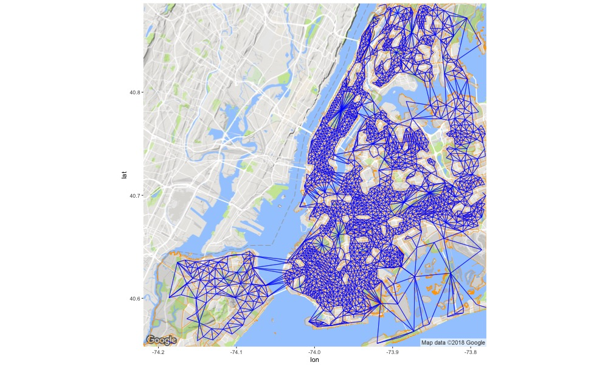
```

Included among the census tracts for which there is accident data are several
large parks and cemetaries, among them Central Park, and Prospect Park and Greenwood Cemetary
in Brooklyn.  In the following zoom of the above neighborhood map we're drawn a circle
around Prospect Park:

```{r plot-nyc-nb-zoom, echo=FALSE, out.width = "70%"}
library(knitr)
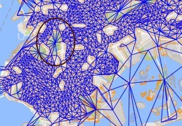
```

In the following plot, the left panel shows the 2001 log population per census tract and
the right panel shows the raw number of 2001 events.

```{r plot-nyc-data, echo=FALSE, out.width = "95%"}
library(knitr)
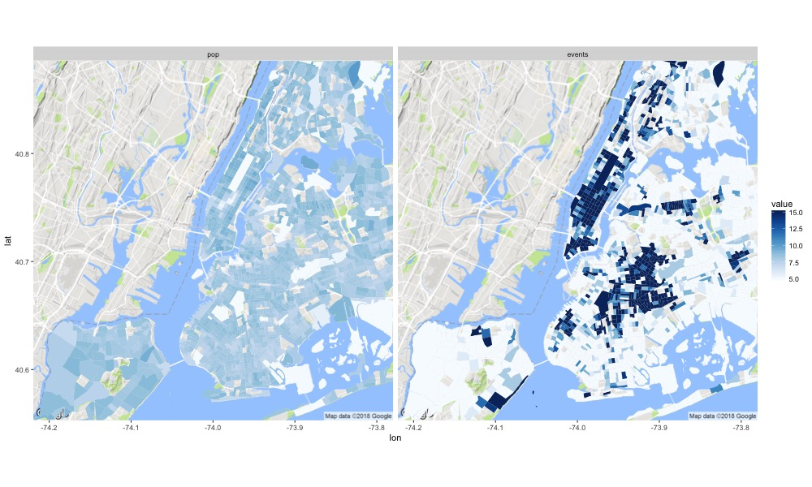
```

While parks are low-population areas, they have a high number of recorded events.
To see this, we again zoom in on Brooklyn:

```{r plot-bk-data, echo=FALSE, out.width = "95%"}
library(knitr)
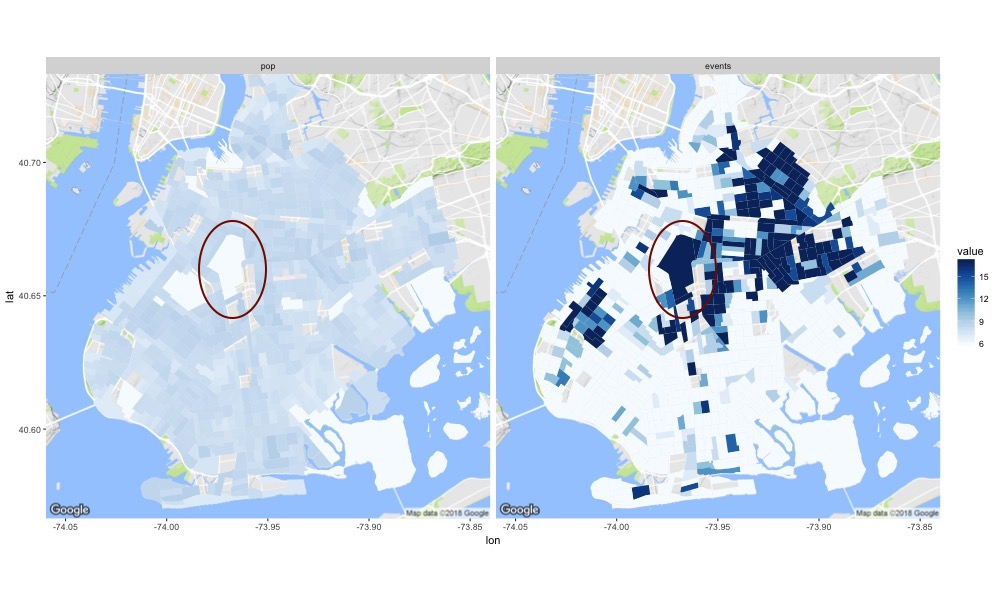
```

Note that Greenwood Cemetary, the large tract slightly below (SE) of Prospect Park
is both unpopulated and uneventful.


#### Baseline model: a simple Poisson GLM

First we strip out the spatial and random effects components from the BYM2 model
and simply fit a Poisson GLM to this data.
The Stan model is:

```{r print-stan-pois }
writeLines(readLines('pois.stan'))
```

The script
[fit_nyc_pois.R](https://github.com/stan-dev/example-models/tree/master/knitr/car-iar-poisson/fit_nyc_pois.R)
compiles and runs the model.


We show side-by-side plots for the raw number of events (left panel) and Poisson fit (right panel) for
all boroughs and just Brooklyn:

```{r plot-nyc-pois, echo=FALSE, out.width = "95%"}
library(knitr)
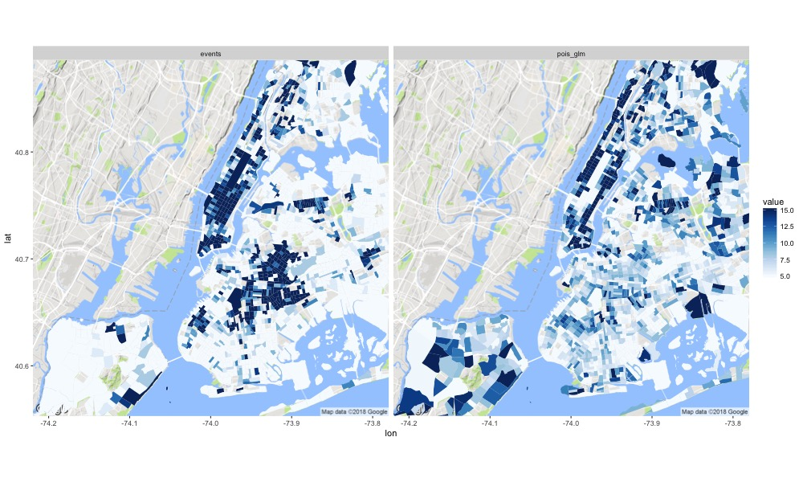
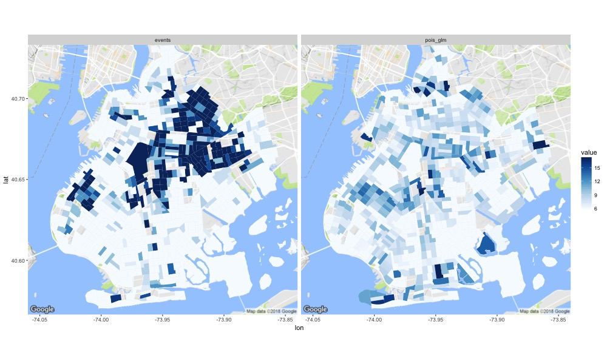
```

#### Adding a vector of random effects (heterogeneous variation only)

Adding an ordinary random effects component allows us to fit the model nicely.
The Stan model is:

```{r print-stan-re }
writeLines(readLines('pois_re.stan'))
```

The script
[fit_nyc_pois_re.R](https://github.com/stan-dev/example-models/tree/master/knitr/car-iar-poisson/fit_nyc_pois_re.R)
compiles and runs the model.
The side-by-side plots of raw number of events (left panel) and the fitted model (right panel) are almost identical:

```{r plot-nyc-pois-re, echo=FALSE, out.width = "95%"}
library(knitr)
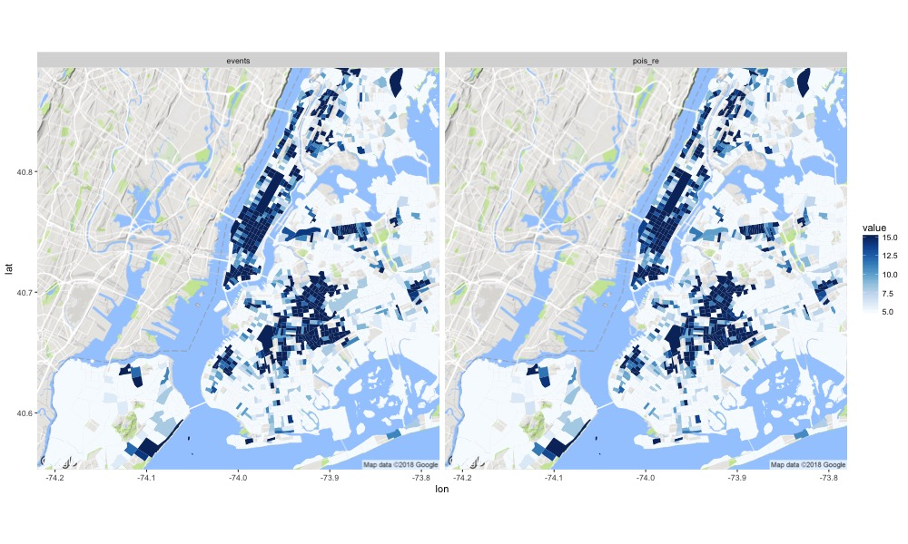
```

#### Adding an ICAR component (spatial smoothing only)

We add an ICAR component to the Poisson regression:
```{r print-stan-icar }
writeLines(readLines('pois_icar.stan'))
```

The script
[fit_nyc_pois_icar.R](https://github.com/stan-dev/example-models/tree/master/knitr/car-iar-poisson/fit_nyc_pois_icar.R)
compiles and runs the model.
The side-by-side plots of raw number of events (left panel) and the fitted model (right panel) differ in a few places,
particularly Central and Prospect Parks.
Because these parks have many neighboring small-count regions, the fitted model brings
the event level down significantly.
In the Brooklyn plot, in the NE (upper right), a few medium-count tracts
in the East New York/ Brownsville areas are upweighted:

```{r plot-nyc-pois-icar, echo=FALSE, out.width = "95%"}
library(knitr)
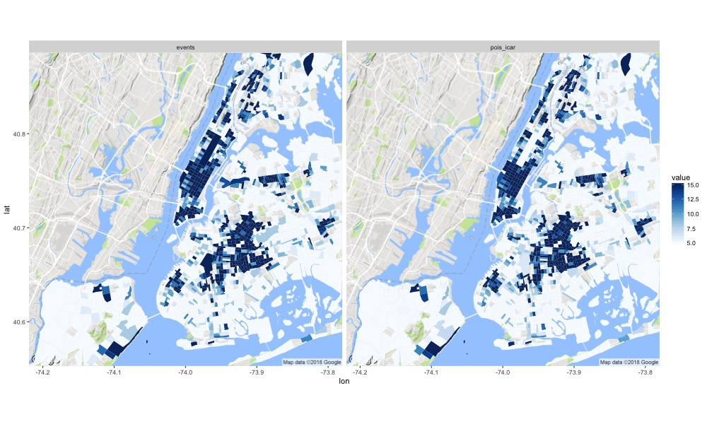
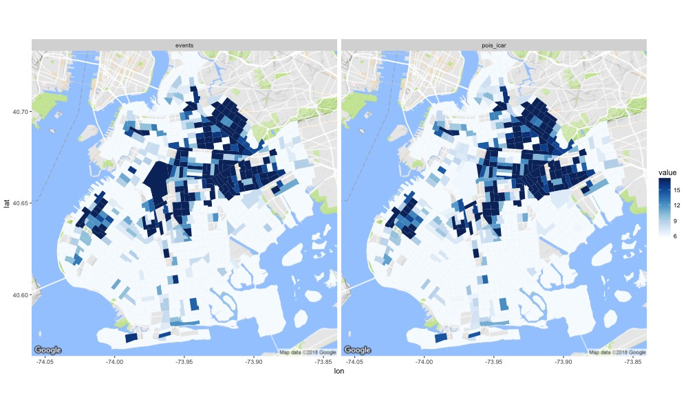
```

#### Visualizing the fitted BYM2 model for New York City and Brooklyn

Finally, we plot the fitted BYM2 model for all boroughs and just Brooklyn.
In comparison with the previous plots, for the BYM2 model
the differences between the data and the fitted model are greater than for
the model `pois_icar.stan` and less than for the model `pois_re.stan`.

```{r plot-nyc-bym2, echo=FALSE, out.width = "95%"}
library(knitr)
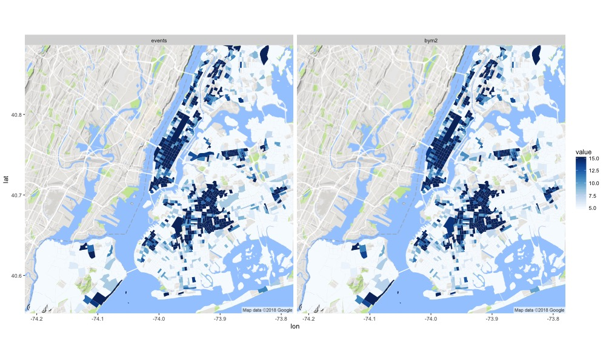
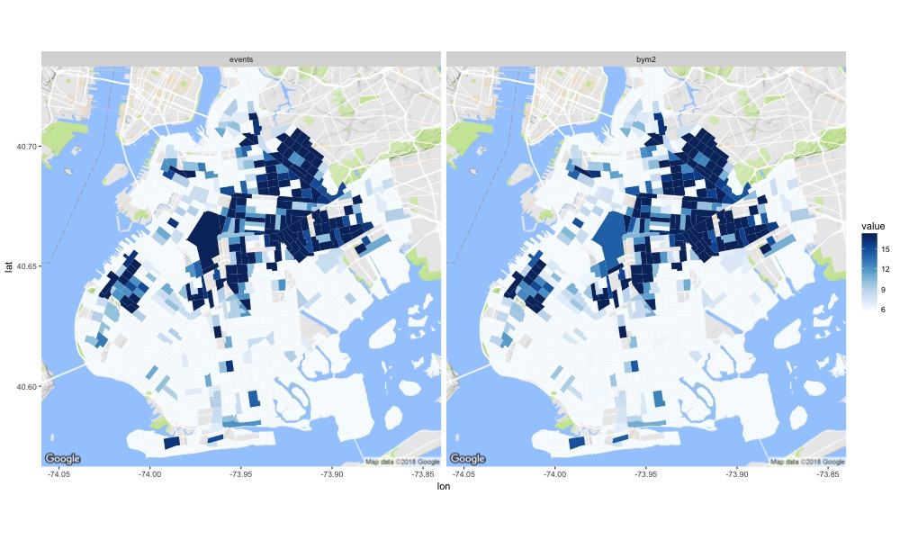
```

## Discussion

In this case study we have shown how to efficiently encode and compute an ICAR component.
To efficiently store the neighborhood structure, we encode
the spatial adjacency matrix as an array of edges of an undirected graph instead
of using a large square matrix.
The pairwise difference for adjacent areal units can be expressed as a single statement
using the Stan's multiple indexing feature and the math library's `dot-self`
function which provides efficient computation of the sum of squares.
The improper nature of the ICAR component means that it can only be used as a prior, not a likelihood.
In order to make the ICAR component identifiable, we use a sum-to-zero constraint.

The BYM model convolves both a spatial ICAR component and a heterogeneous random effects component.
There are many variants of this model which differ in the parameterization of these two components.
This model is difficult for an MCMC sampler to fit unless there are strong hyperpriors on the scale of each component.
Here we follow Riebler et al 2016 in choosing to use a mixing parameter `rho` and a
scaling factor which is derived from the structure of the neighborhood graph,
in order to determine the amount of spatial structure present in the data.

The data subset that we are using for this case study is limited to 1921 out of
a total of 2168 census tract regions. This subset is a few column's worth of data
taken from a study which focussed on child safety, and both the population and
accident data had been stratified into age brackets.  Using just the total population
and total number of accidents provides very little information with which to fit a model.
But we're not trying to come up with policy solutions, we're trying to get a feel for
what the components of these models do, and from this perspective, working with
almost no data is ideal, because a few anomalous situations, in particular,
accidents which occur in parks, provide good illustrations of how ICAR models
provide spatial smoothing.


## Acknowledgements

Daniel Simpson contributed the section "A better parameterization of the Besag, York, and Mollié model".
Many thanks to Imad Ali, Michael Betancourt, Bob Carpenter, Andrew Gelman, and Rob Trangucci for all their help and encouragement,
as well as to Miguel A. Martínez Beneito and Paqui Corpas of FISABIO, Valencia Spain.

Funded in part by the National Institute of Child Health and Human Development, grant number 1R01HD087460-01, Charles DiMaggio Principal Investigator.

## References


### Literature

* Banerjee, Sudipto, Alan E. Gelfand, and Bradley P. Carlin. "Hierarchical modeling and analysis for spatial data." (2003).

* Bernardinelli, L., Clayton, D. and Montomoli, C. (1995). Bayesian estimates of disease maps: How important are priors? Statistics in Medicine 14 2411–2431.

* Besag, Julian. "Spatial interaction and the statistical analysis of lattice systems." Journal of the Royal Statistical Society. Series B (Methodological) (1974): 192-236.

* Besag, Julian, and Charles Kooperberg. "On conditional and intrinsic autoregression." Biometrika (1995): 733-746.

* Besag, J., J. York, and A. Mollie. "Bayesian image restoration with two applications in spatial statistics (with discussion) Ann Inst Stat Math. 1991; 43: 1–59. doi: 10.1007." BF00116466.[Cross Ref].

* Dean, C. B., Ugarte, M. D. and Militino, A. F. (2001). Detecting interaction between random region and fixed age effects in disease mapping. Biometrics 57 197–202.

* Haran, Murali. "Gaussian random field models for spatial data." Handbook of Markov Chain Monte Carlo (2011): 449-478.

* Riebler, Andrea, Sigrunn H. Sørbye, Daniel Simpson, and Håvard Rue. "An intuitive Bayesian spatial model for disease mapping that accounts for scaling." Statistical methods in medical research 25, no. 4 (2016): 1145-1165.

* Wakefield, J. (2007). Disease mapping and spatial regression with count data. Biostatistics 8 158–183.

#### R Packages

* Statistics: [RStan](http://mc-stan.org/users/interfaces/rstan.html), [RStanArm](http://mc-stan.org/users/interfaces/rstanarm.html), [R2OpenBugs](https://cran.r-project.org/web/packages/R2OpenBugs), OpenBUGS, [R-INLA](http://www.r-inla.org).

* Plots and supporting libraries: [ggplot2](http://ggplot2.org),  [ggmap](https://cran.r-project.org/web/packages/ggmap), [dplyr](https://cran.r-project.org/web/packages/dplyr), [tidy](https://cran.r-project.org/web/packages/tidy)

* Spatial Data: [maptools](https://cran.r-project.org/web/packages/maptools),
[spdep](https://cran.r-project.org/web/packages/spdep),
[rgdal](https://cran.r-project.org/web/packages/rgdal)

### Licenses

<small>
**Code:** Copyright (2018) Columbia University.  Released under the
[BSD 3-clause license](https://opensource.org/licenses/BSD-3-Clause).
</small>

<small>
**Text:** Copyright (2018) Mitzi Morris.  Released under the
the [CC BY-NC 4.0
license](https://creativecommons.org/licenses/by-nc/4.0/).
</small>
