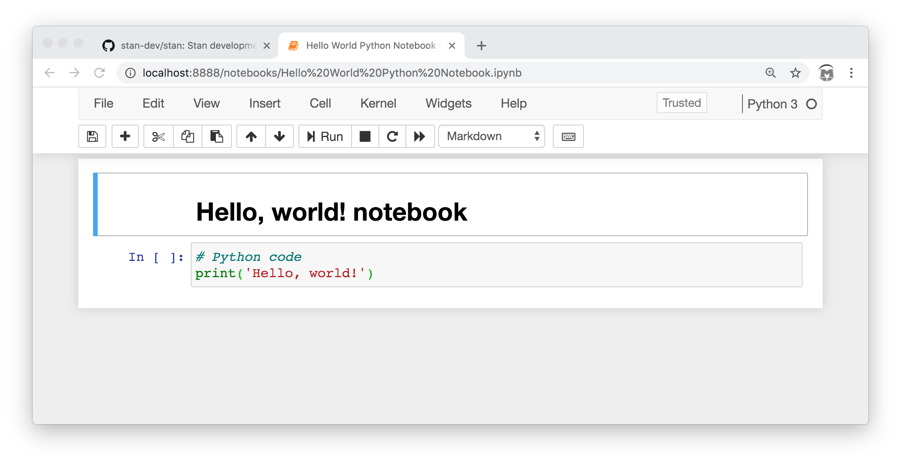
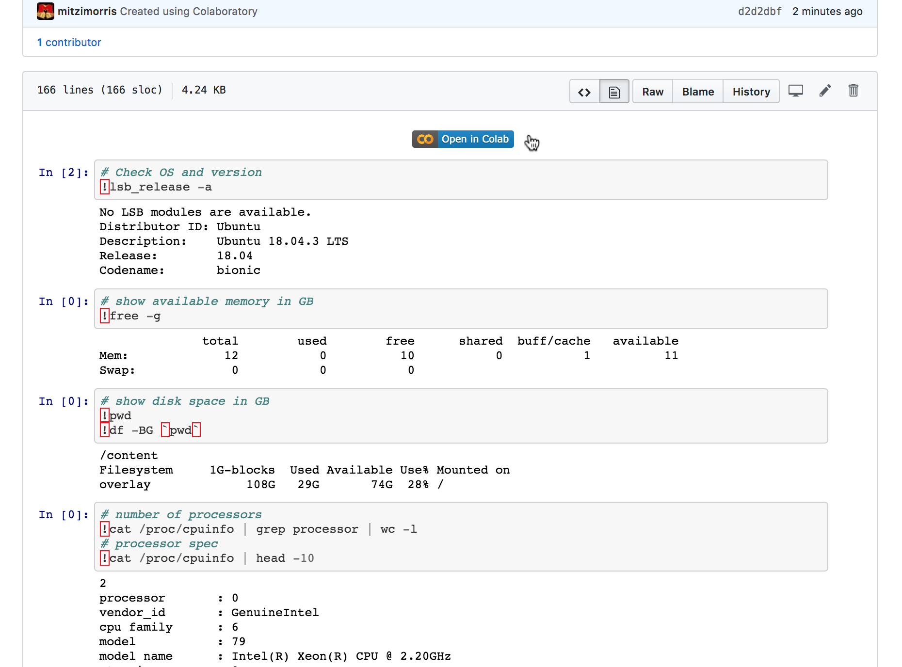
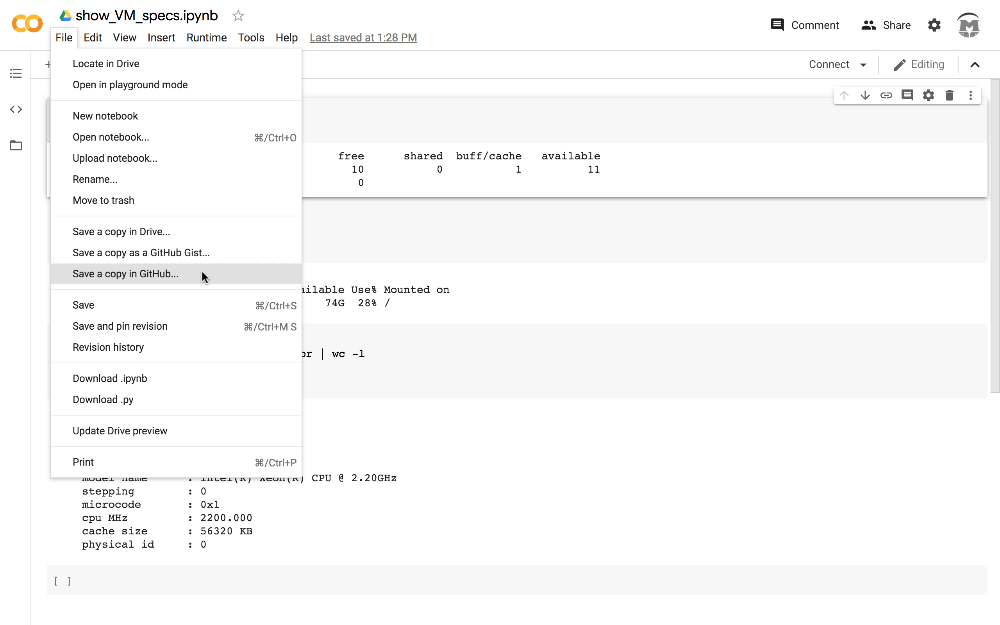
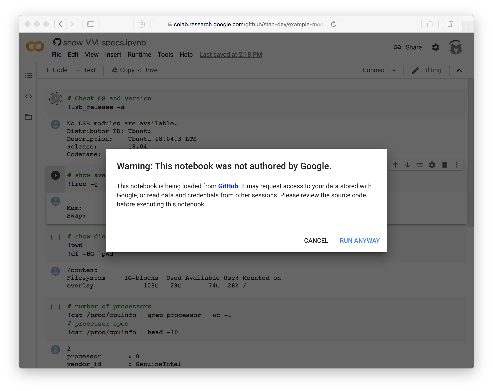
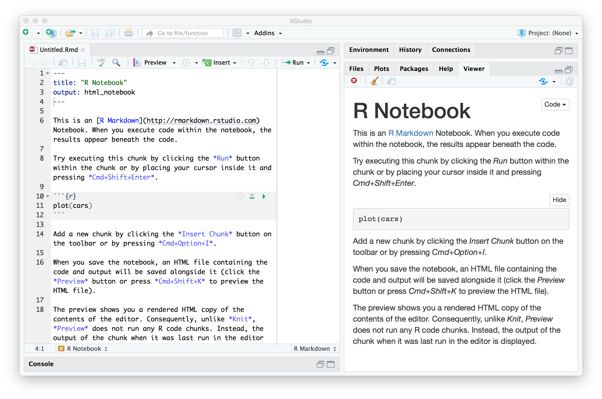
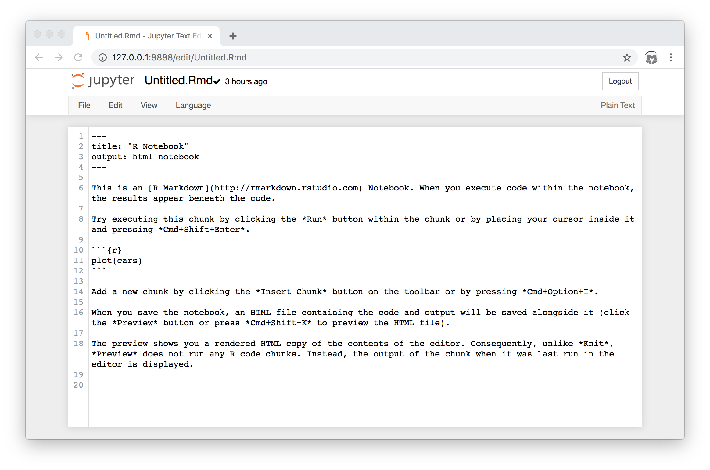
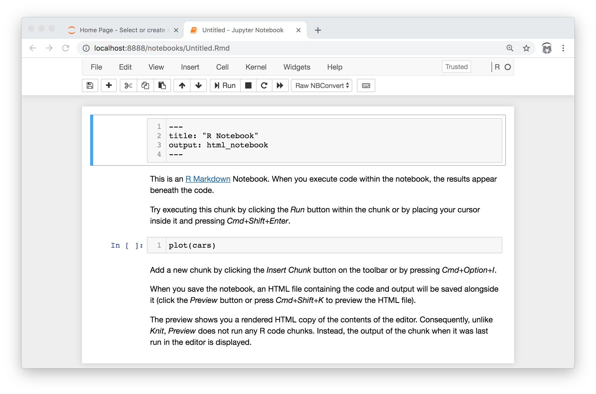
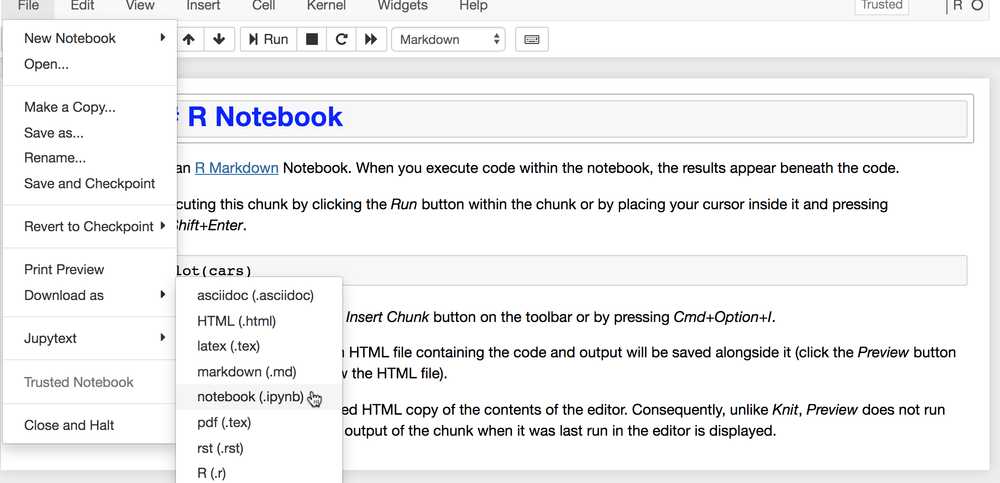
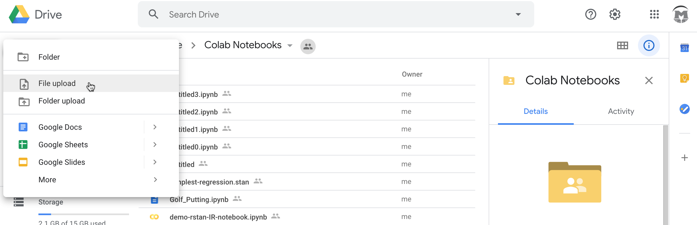

<style type="text/css">
.table { width: 40%; }
blockquote {
    padding: 10px 20px;
    margin: 0 0 20px;
    font-size: 0.95em;
    border-left: 5px solid #eee;
}
p.caption {
  font-size: 0.9em;
  font-style: italic;
  margin-right: 10%;
  margin-left: 10%;  
  text-align: justify;
}

</style>

```{r setup, include=FALSE}
knitr::opts_chunk$set(cache=TRUE, message=FALSE, error=FALSE, warning=FALSE, comment=NA, out.width='90%', tidy.opts=list(width.cutoff=60), tidy=TRUE, fig.pos='H')
def.chunk.hook  <- knitr::knit_hooks$get("chunk")
knitr::knit_hooks$set(chunk = function(x, options) {
  x <- def.chunk.hook(x, options)
  ifelse(options$size != "normalsize", paste0("\\", options$size,"\n\n", x, "\n\n \\normalsize"), x)
})
```

Putting your Stan model and data into a Jupyter notebook
lets your audience work through your analysis step by step.
The challenge in a demo, talk, or classroom situation
is getting everyone in the room on the same page,
when the page in question is your notebook running in their browser.
Unfortunately, the law of conservation of energy mandates that
the easier things are for your audience, the harder they become for you.
This report takes you through the tedious details of setting up
a Jupyter Notebook so that anyone
with a modern web browser and a Google account
can run your Stan analysis in the cloud (Google Colaboratory).


### Introducing CmdStanR and CmdStanPy!!

The example notebooks for R and Pythin in this report use
two new lightweight interfaces to Stan:
[CmdStanR](https://mc-stan.org/cmdstanr/articles/cmdstanr.html) and
[CmdStanPy](https://cmdstanpy.readthedocs.io/en/latest/index.html).
They were developed with the following goals:

- Simplicity and modularity: these packages wrap CmdStan and
just provide functions to compile models, do inference,
and assemble and save the results;
other packages are needed for downstream analysis

- Keep up with Stan releases: these interfaces can use
any (recent) version of CmdStan, including the current release, Stan 2.22.

- Quick and easy installation: minimal dependencies with other packages and no direct calls to C++.

- Flexible licensing:  BSD-3.


### Jupyter 101

A Jupyter notebook consists of blocks of markdown text interleaved
with blocks of statements which unifies the exposition of ideas and arguments
with the necessary supporting data, computation, and visualizations.
The three core programming languages supported are
Julia, Python, and R, hence the name, *Ju-Pyt-R*.
In order to author a Jupyter notebook on your machine, you need a local install
of both Python and Jupyter, as outlined in the
[Jupyter installation instructions]([https://jupyter.readthedocs.io/en/latest/install.html).
Once the Jupyter server is running, you can then run existing notebooks and create new
notebooks via your favorite web browser.

A notebook document is a JSON file with suffix `.ipynb` which
contains a list of cells, one cell per content block (code, text or image),
and a dictionary of metadata which specifies the kernel used to run
the notebook, here, either R or Python.
When viewed in a browser,  the notebook is displayed as an HTML page where
the contents of the text cells are rendered by default while
the code cells are displayed with controls which allow them to be executed independently.
Additional controls allow you to create, edit, 
and publish notebooks as HTML or pdf documents.

```{r figHelloNotebook, echo=FALSE, out.width = "75%", fig.cap="Jupyter notebook in the browser"}
library(knitr)

```

By distributing an `ipynb` notebook file together with your
Stan model and data, your audience can replicate your analysis on their machine.
But in order to do this, they must have a local install of
the Jupyter notebook server or other IDE that can run the notebook.
This is not always possible; they might
not have have enough permissions to install software on their computer
or their machine might not have enough memory or a powerful enough CPU to run Stan.
You could give them access to your machine by running a
[Jupyter notebook server](https://jupyter-notebook.readthedocs.io/en/stable/public_server.html)
for single-user access or
[JupyterHub server](https://jupyterhub.readthedocs.io/en/latest/) for multiple-user access,
but this requires bandwidth, compute power, and careful attention to
[security](https://jupyter-notebook.readthedocs.io/en/stable/public_server.html#notebook-server-security).
Regarding security, here's some wisdom from the [Jupyter blog](https://blog.jupyter.org/public-notebooks-and-security-3058c433c884),
(emphasis added)

> It is important to keep in mind that, since **arbitrary code execution is the main point of IPython and Jupyter**, running a publicly accessible server without authentication or encryption is a very bad idea indeed.

Hence the need for Jupyter servers in the cloud: many instances of
someone else's server where the audience can run your notebook.

### Challenge: Free Servers

It is a truth, universally acknowledged,
that there ain't no such thing as a free lunch.
Nonetheless, as of 2020, Google is providing
free email via Gmail,
free file storage via Google Drive,
and free Jupyter notebook servers via 
[Google Colab](https://en.wikipedia.org/wiki/Project_Jupyter#Colaboratory).
To use these services, you must sign up for a [Google account](https://myaccount.google.com/intro).
The Colab server instances are limited, as is the amount of storage on your Google Drive,
and should you use Gmail, Google examines all messages and serves ads accordingly;
there ain't no such thing as a free lunch, Q.E.D.

#### Colab 101

When you run a notebook on Colab, the Jupyter server is
running on a virtual machine hosted by Google.
Google makes no promises about VM availability or resources,
(see https://research.google.com/colaboratory/faq.html),
however you can inspect the virtual machine instance that a notebook
is running on via system commands.
To see how this works, I created a notebook called `show_VM_specs.ipynb`,
which I ran in Colab and then saved to the
[GitHub repo for this report](https://github.com/stan-dev/example-models/blob/case-study/stan-cloud/knitr/cloud-compute-2020/show_VM_specs.ipynb).


******** walk through running of notebook, screenshot by screenshot **********

This is an [IPython notebook](https://jakevdp.github.io/PythonDataScienceHandbook/01.05-ipython-and-shell-commands.html),
therefore exclamation point symbol '!' executes a shell command. [^1]

[^1]: The red boxes around exclamation points and backticks are an artifact from GitHub's syntax highlighter and should be ignored.

```{r figColabStats, echo=FALSE, out.width = "75%", fig.cap="Interrogate the Colab VM"}
library(knitr)

```


As can be seen from the saved output, when this notebook was last executed on Colab,
it ran on a VM instance with 12 GB RAM, 2 Intel Xeon 2.2Ghz processors, and
100 GB storage on the local file system running the Ubuntu (Linux) operating system.
This is sufficient to use Stan to fit small-to-medium models on small-to-medium datasets;
i.e., good enough for demos and classroom exercises.
Colab is a gateway drug - for large-scale processing pipelines
you'll need to move up to Google Cloud Platform or one of its competitors AWS, Azure, etc.
A Colab VM persists for approximately 10 or 12 hours from first spin-up,
therefore you must upload/download local files to your Google Drive or another cloud storage system
in order to save your work.


#### A few words on Colab security and authorization

The above notebook was notebook was saved to GitHub from Colab via
the "Save a copy in GitHub" option from the Colab UI "File" tab.


```{r figColabSave, echo=FALSE, out.width = "75%", fig.cap="Saving a notebook to GitHub"}
library(knitr)

```

This automatically added the "Open in Colab" button as the first notebook cell.
In order to run this notebook in Colab, you must first be logged into your Google Account.
Once logged in, when you first attempt to run the notebook, you will get a warning
that the notebook may request access to your data or read stored credentials.


```{r figColabWarn, echo=FALSE, out.width = "75%", fig.cap="Security warning for GitHub notebooks"}
library(knitr)

```

This is a valid warning!
However, in order for a notebook to access your Google Drive, it must use the
the [Google Drive API](https://developers.google.com/drive/api/v3/about-sdk),
and this will be evident by reading through the markdown and Python notebook cells.
So don't take my word that these notebooks are safe;
review the notebook source code before clicking "RUN ANYWAY" (or "CANCEL").


### Challenge: Fast Spin-up


In a talk, class, or demo situation every minute spent installing
software is a minute less for the presentation itself.


introduction time waiting
for machines to spin up and packages to install, however, there is necessarily some overhead
in accessing notebooks and logging on to Colab.

A Colab virtual machine instance has both Python and R already installed,
as well as both the clang and gcc-7 C++ compilers.
But to run the current Stan release (Stan 2.22) from R or Python, you need either
CmdStanR or CmdStanPy as well as a local CmdStan installation.
As CmdStanR and CmdStanPy are lightweight packages with minimal dependencies,
it doesn't take much time to download and install them from GitHub, Cran, or PyPi.
Both packages provide a function `install_cmdstan` which downloads and
compiles the latest CmdStan release.  Unfortunately, this can take upwards of 10 minutes.
To avoid this, we have created a CmdStan binary for Colab.
Because Google is currently offering limited free storage on the Google Cloud Platform,
we are storing these CmdStan binaries in the cloud.
From a Colab notebook, downloading and unpacking the pre-compiled binaries takes on the order of 10 seconds.

Fast spin-up using CmdStan binaries for Colab consists of three steps:

* Install the CmdStanPy or CmdStanR package.
* Download the pre-compiled CmdStan binaries for Google Colab.
* Register the CmdStan install location in the R or Python session.

To see how this works, I have created two example notebooks for Colab
which run CmdStan's example model `bernoulli.stan`: 
[CmdStanR_Example_Notebook.ipynb](https://github.com/stan-dev/example-models/blob/case-study/stan-cloud/knitr/cloud-compute-2020/CmdStanR_Example_Notebook.ipynb)
and 
[CmdStanPy_Example_Notebook.ipynb](https://github.com/stan-dev/example-models/blob/case-study/stan-cloud/knitr/cloud-compute-2020/CmdStanPy_Example_Notebook.ipynb)

#### CmdStanR notebook spin-up

The initial cells of the CmdStanR_Example_Notebook follow the steps described above.
To create this notebook, it was necessary to first create an
IR notebook using Jupyter running on my notebook, then upload it to Google Drive.
The first cell in the CmdStanR notebook installs the CmdStanR package, as needed.
CmdStanR is not yet on CRAN, so we install from GitHub instead.
To speed up the install process, only the necessary dependencies
are are installed.
```
# Install package CmdStanR from GitHub
library(devtools)
if(!require(cmdstanr)){
  devtools::install_github("stan-dev/cmdstanr", dependencies=c("Depends", "Imports"))
  library(cmdstanr)
}
```
The following cells download the precompiled CmdStan binaries
and register the path to the CmdStan installation:
```
# Install CmdStan binaries
if (!file.exists("cmdstan-2-22-1.tgz")) {
  system("wget https://storage.googleapis.com/cmdstan-2-22-tgz/cmdstan-2-22-1.tgz", intern=T)
  system("tar zxf cmdstan-2-22-1.tgz", intern=T)
}
list.files("cmdstan-2.22.1")

# Set cmdstan path to CmdStan installation
set_cmdstan_path("cmdstan-2.22.1")
```

#### Spinning up a CmdStanPy Notebook

The CmdStanPy_Example_Notebook contains the Python version of the fast spin-up steps.
CmdStanPy requires Python3, which is the default runtime for new Colab notebooks.
CmdStanPy is a pure-Python package which can be installed from PyPI:

```
!pip install cmdstanpy
```
We can use Python to download and unpack the precompiled CmdStan binaries:
```
# Download, unpack CmdStan binaries
import os
import urllib.request
import shutil
tgz_file = 'cmdstan-2-22-1.tgz'
tgz_url = 'https://storage.googleapis.com/cmdstan-2-22-tgz/cmdstan-2-22-1.tgz'

if not os.path.exists(tgz_file):
  try:
    urllib.request.urlretrieve(tgz_url, tgz_file)
    shutil.unpack_archive(tgz_file)
  except Exception:
    raise KeyboardInterrupt
```
The following cells check the CmdStan installation and register its location:
```
# Specify CmdStan location via environment variable
import os
os.environ['CMDSTAN'] = './cmdstan-2.22.1'

# Check CmdStan path
from cmdstanpy import cmdstan_path
cmdstan_path()
```

### Challenge: Putting the R in Jupyter

This section is for all Stan users who work primarily in R and RStudio.
It shows you how to get your local Jupyter environment set up and how
to translate R Markdown documents to Jupyter notebooks.

In order to author Jupyter notebooks for R, you also need a local install of R as well as
the [IRkernel package](https://irkernel.github.io), the R kernel for Jupyter notebook,
[installation instructions here](https://irkernel.github.io/installation/).

Jupyter notebooks for R are similar to RStudio's
[R Markdown documents](https://rmarkdown.rstudio.com),
in that both contain chunks of R code, interleaved with chunks of text.
Underlyingly, Jupyter notebooks are JSON documents with suffix `.ipynb`
while R markdown documents are in R Markdown format and have suffix `.Rmd`.
Although the RStudio IDE provides an R Markdown notebook interface,
notebooks authored via the RStudio IDE are in R Markdown format,
not Jupyter Notebook format.

```{r fig1, echo=FALSE, out.width = "75%", fig.cap="RStudio R Notebook"}
library(knitr)

```

The RStudio interface calls this a notebook, but the resulting file is still in R Markdown format:
```{r rmarkdown-notebook, size="footnotesize", echo=FALSE,  fig.cap="Notebook file"}
cat(readLines('Untitled.Rmd', n=15), "...", sep="\n");
```

When viewed with Jupyter, this document is treated as a raw text file.
```{r fig2, echo=FALSE, out.width = "75%", fig.cap="R Markdown document in Jupyter browser"}
library(knitr)

```

An extremely useful Python package called [Jupytext](https://jupytext.readthedocs.io/en/latest/)
allows you to convert from R Markdown to Jupyter notebook format and back again.
After [installation](https://jupytext.readthedocs.io/en/latest/install.html),
Jupyter now treats R Markdown documents as notebooks.
```{r fig3, echo=FALSE, out.width = "75%", fig.cap="R Markdown document in Jupyter with juptext extension"}
library(knitr)

```

Juptext identified the R Markdown YAML header as its own block, with celltype `raw`,
and converted the next three chunks to notebook cells with celltype `markdown`, `code`, and `markdown`, respectively.
After editing and testing the notebook in the browser, you can save it as
a Jupyter R notebook via the options menu tab **"File"**, selection **"Download as"**, option **"notebook (.ipynb)"**.

```{r fig4, echo=FALSE, out.width = "75%", fig.cap="Convert R Markdown file to Jupyter notebook"}
library(knitr)

```

Congratulations, you now have a Jupyter R notebook that you can share with the world!
Anyone who has access to a Jupyter server can recreate and extend your analysis.

#### Putting the R in Colab

In order to run a Jupyter notebook via Colab, it must be available on the web or your Google Drive.
Google Drive lets you can create new Python notebooks or upload existing notebooks from your local machine.
To share a Jupyter R notebook with the world, you will need to author the notebook locally and then upload it
to Google Drive:

```{r figGgoogle, echo=FALSE, out.width = "75%", fig.cap="Upload to Google Drive"}
library(knitr)

```

Alternatively, you could use this [this empty R notebook](https://github.com/stan-dev/example-models/blob/case-study/stan-cloud/knitr/cloud-compute-2020/template_IR_notebook.ipynb).


### Next steps

These notebooks provide a starting point for running Stan in the Cloud, but they are toy examples.
An interesting, sharable Stan notebook to present your model and analysis would require the following structure, with cells to do the following computations:

- Assemble, plot data
- Compile, display Stan model
- Fit the model to data
- Display inferences
- Graph data and fitted model

An extremely interesting Stan notebook would expand the above to the full Bayesian workflow:

- Read in data
- Graph data
- Fit model 1 to data
- Graph data and fitted model
- Simulate fake data from model 1, fit model 1, and informally check that the inferences are close to the assumed parameter values
- Expand model 1 to create model 2
- Repeat the above steps for model 2
- Compare the two models


