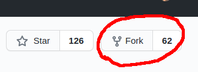
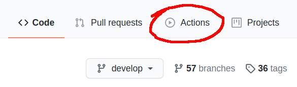
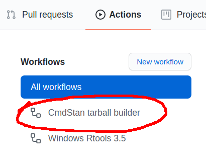
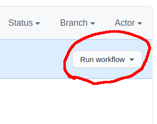
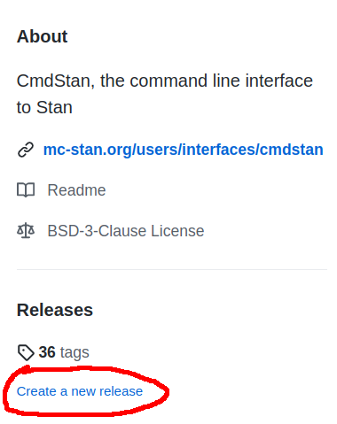

## Introduction

The CmdStan tarball builder Github Action can be used to automatically build a
portable (MacOS/Linux/Windows) CmdStan tarball from a combination of `cmdstan`,
`stanc`, `stanc3`, and `math` Github branches. The goal of this Github Action is
to make it easier to share experimental Stan work.

The two basic steps to use the CmdStan tarball builder are building and
distributing. The Github action will handle the building part. Github releases
are useful for the distributing part, and make it so that the custom CmdStan
can be used directly in [cmdstanr](https://mc-stan.org/cmdstanr/).

## Building the CmdStan tarball

To use the CmdStan tarball builder Github Action,

1. Fork a copy of the [CmdStan repository](https://github.com/stan-dev/cmdstan).
The **Fork** button is in the upper right hand corner of the page. If you already
have a fork of cmdstan, make sure your cmdstan fork is up to date with the
latest `stan-dev/cmdstan` develop branch.

    

2. Navigate to the Github Actions page. The **Actions** button is at the top of
the page below the repository title

    

3. Select the **CmdStan tarball builder** Github action from the workflows on the
left hand side of the page.

    

4. Click the **Run workflow** dropdown button on the right hand side of the page.

    

5. Fill in a name for the custom CmdStan you are building along with the Github
repository names and branches from which you want to build it. There should be
a **Run Workflow** button at the bottom of this form that will start the build.

Github should forward you to a status page for the action. It may take an hour
or so to build the binaries, but once they are finished there should be an
appropriately named artifact available to download.

## Distributing the CmdStan Tarball

The two drawbacks to the Github Actions artifact outputs are that the output is
not easily downloaded (the artifact download link does not work when it is
copy-pasted), and the tarball is compressed in a zip file (which is slightly
inconvenient).

Github releases are useful for overcoming these difficulties. To do a Github
release of your development CmdStan,

1. Download the CmdStan artifact and unzip it.

2. Create a new Github release. There should be a link for this on the right
hand side of the page under **Releases**

    
    
3. Specify a tag, name your release, and add a description of what makes your
CmdStan special. There should be a link at the bottom to upload a file. Upload
the unzipped tarball from the first step (leave it as a `.tgz` file -- don't
untar it to a folder).

    

4. Once the file finishes uploading click **Publish release**. You should be
redirected to the release page which will have a shareable link to the uploaded
tarball.

## Sharing Installation Instructions

With the Github release, it should be possible for CmdStan users to download
the tarball directly from the release page and use it. R users can use the
`cmdstanr::install_cmdstan` command with a custom `release_url` to use the
custom CmdStan.

For instance, if the final release url is `https://github.com/stan-dev/cmdstan/releases/download/v2.26.1/cmdstan-2.26.1.tar.gz`,
then a `cmdstanr` user can install it with:

```
cmdstanr::install_cmdstan(release_url = "https://github.com/stan-dev/cmdstan/releases/download/v2.26.1/cmdstan-2.26.1.tar.gz")
```

It may also be useful to build a custom `cmdstanr` (if the custom CmdStan has
different arguments). This can be done by pointing `devtools::install_github` at
the appropriate repository and branch:

```
devtools::install_github("https://github.com/stan-dev/cmdstanr/tree/develop")
```
