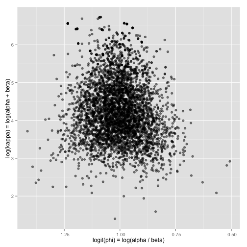
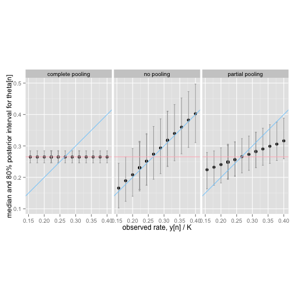

### Abstract

<small>This note illustrate the effect of pooling on chance-of-success estimates for repeated binary trial data (i.e., a bounded count of the number of successes out of a fixed number of trials).  We develop Stan models and R code to fit and check predictive models for three situations: (a) complete pooling, which assumes each item is the same, (b) no pooling, which assumes the items are unrelated, and (c) partial pooling, where the similarity among the items is estimated.</small>


## Bounded Count Data

Suppose that for each of $N$ individuals, we observe $y_n$ successes out of $K_n$ attempts.  For instance, the data may consist of repeated clinical trials, with $y_n$ rates dying of $K_n$ rates in trial $n \in 1{:}N$.  Or the data may consist of $y_n$ hits in $K_n$ at bats for a baseball player.  These are the classic examples treated Efron and Morris's seminal 1970s paper genealizing the James-Stein estimator (Efron and Morris 1975) and as the first
example of a hierarchical model in chapter 5 of Gelman et al.'s <i>Bayesian Data Analysis</i>, a widely used 2010s textbook on Bayesian inference (Gelman et al. 2013).

### Efron and Morris's Baseball Data

We include the data from Table 1 of (Efron and Morris 1975) as
<code>data.tsv</code> (it was downloaded 24 Dec 2015 from [here](http://www.swarthmore.edu/NatSci/peverso1/Sports%20Data/JamesSteinData/Efron-Morris%20Baseball/EfronMorrisBB.txt)).

```r
df <- read.csv("data.tsv", sep="\t");
df <- data.frame(FirstName = df$FirstName,
                 LastName = df$LastName,
                 Hits = df$Hits,
                 At.Bats = df$At.Bats,
                 RemainingAt.Bats = df$RemainingAt.Bats,
                 RemainingHits = df$SeasonHits - df$Hits);
print(df);
```

```
   FirstName   LastName Hits At.Bats RemainingAt.Bats RemainingHits
1    Roberto   Clemente   18      45              367           127
2      Frank   Robinson   17      45              426           127
3      Frank     Howard   16      45              521           144
4        Jay  Johnstone   15      45              275            61
5        Ken      Berry   14      45              418           114
6        Jim    Spencer   14      45              466           126
7        Don  Kessinger   13      45              586           155
8       Luis   Alvarado   12      45              138            29
9        Ron      Santo   11      45              510           137
10       Ron    Swaboda   11      45              200            46
11      Rico Petrocelli   10      45              538           142
12     Ellie  Rodriguez   10      45              186            42
13    George      Scott   10      45              435           132
14       Del      Unser   10      45              277            73
15     Billy   Williams   10      45              591           195
16      Bert Campaneris    9      45              558           159
17   Thurman     Munson    8      45              408           129
18       Max      Alvis    7      45               70            14
```
We will only need a few columns of the data, and we know the counts are all the same. 

```r
N <- dim(df)[1];
K <- (df$At.Bats)[1]
y <- df$Hits
```

The data separates the outcome from the initial 45 at-bats from the rest of the season.  After running this code, <code>K1</code> is an integer number of at-bats.  Then for each player <code>n</code>, <code>y1[n]</code> is the initial number of hits, <code>K2[n]</code> is the remaining number of at-bats, and <code>y[n]</code> is the total number of hits; the season number of at-bats for player <code>n</code> is thus <code>K1 + K2[n]</code>.

In Stan, the initial at-bats for the <code>N</code> players are represented with the following declarations.
```
data {
  int<lower=0> N;              // items
  int<lower=0> K;              // initial trials
  int<lower=0,upper=K1> y[N];  // initial successes
}
```

## Pooling

With complete pooling, each item is assumed to have the same chance of success.  With no pooling, each item is assumed to have a completely unrelated chance of success.  With partial pooling, each item is assumed to have a different chance of success, but all of the observed items estimates are used to inform the estimates of other item.

In a hierarchical model, the population of items is directly modeled, typically with a mean chance of success for the population and a scale of abilities modeling the average member and amount of variation within a population.

In this section, all three types of pooling models will be fit and their inferences for Efron and Morris's baseball data example.


### Model 1: Complete Pooling

The complete pooling model assumes a single parameter $\theta \in (0,1)$ representing the chance of success for all items:

```
parameters {
  real<lower=0,upper=1> theta;     // chance of success
}
```

By default, Stan places a uniform prior on all parameters.  Because <code>theta</code> is bounded to lie between 0 and 1, this uniform distribution is proper, and results in the prior
\[
p(\theta) = \mathsf{Uniform}(\theta \, | \, 0,1).
\]
This does not need to be expressed in the model.

Assuming each player's at-bats are independent Bernoulli trials, the likelihood for each player is modeled as
\[
p(y_n \, | \, \theta) = \mathsf{Binomial}(y_n \, | \, K, \theta).
\]
Assuming each player is independent leads to the data likelihood
\[
p(y \, | \, \theta) = \prod_{n=1}^N \mathsf{Binomial}(y_n \, | \, K, \theta).
\]

The prior is implicit and does not need to be coded.  The likelihood is expressed as a vectorized sampling statement in Stan as
```
model {
  y ~ binomial(K, theta);
}
```
The vectorized form above is equivalent to, but less efficient than an explicit for loop, as in
```
  for (n in 1:N)  
    y[n] ~ binomial(K, theta);
```

The full Stan program for the simple model with no pooling is as follows.


```
data { 
  int<lower=0> N;                // items 
  int<lower=0> K;                // initial trials 
  int<lower=0, upper=K> y[N];    // initial successes 
} 
parameters { 
  real<lower=0, upper=1> theta;  // player ability 
} 
model { 
  y ~ binomial(K, theta);        // likelihood 
} 
```
We start by loading the RStan package.

```r
library(rstan);
```
The model can be fit as follows, reading the data out of the environment by name (the output result of running Stan are hidden).

```r
fit_pool <- stan("pool.stan", data=c("N", "K", "y"));
ss_pool <- extract(fit_pool);
```

Then the results can be printed as follows, with only the median (50% quantile), and edges of the central 80% interval (10% and 90% quantiles).

```r
# print(fit_pool, probs=c(0.1, 0.5, 0.9));
```
See the Stan manual for more information on the meanings of the columns in the output; briefly they are the posterior mean, MCMC standard error of the mean, posterior standard deviation, quantiles, effective sample size, and R hat convergence diagnostic.  The first row is for parameter <code>theta</code> and the second for the unnormalized log density, written as <code>lp__</code>.  Both <code>theta</code> and <code>lp__</code> have an Rhat value that is consistent with convergence.

The result is a posterior mean estimate for $\theta$ of $\bar{\theta} = 0.27$ with a 90% posterior interval of $(0.25, 0.29)$. 

The complete pooling results are too conservative in that many players exceed 0.30 chance of success of achieving a hit in an at-bat.


### Model 2: No Pooling

A model with no pooling assumes a separate chance-of-success parameter $\theta_n \in (0,1)$ for each item $n$.  The Stan program for no pooling only differs in declaring the ability parameters as an $N$-vector rather than a scalar.  

Formally, the prior assumes $\theta_n$ is uniform,
\[
p(\theta_n) = \mathsf{Uniform}(\theta_n \, | \, 0,1),
\]
and that the $\theta_n$ are independent, 
\[
p(\theta) = \prod_{n=1}^N \mathsf{Uniform}(\theta_n \, | \, 0,1).
\]
The likelihood uses each item's number of successes is binomial, 
\[
p(y_n \, | \, \theta_n) = \mathsf{Binomial}(y_n \, | \, K, \theta_n)
\]
and assumes independence,
\[
p(y \, | \, \theta) = \prod_{n=1}^N \mathsf{Binomial}(y_n \, | \, K, \theta_n).
\]

With the implicit prior and vectorization in the binomial sampling statement, the Stan program for no pooling is as follows.

```
data { 
  int<lower=0> N;                     // items 
  int<lower=0> K;                     // initial trials 
  int<lower=0, upper=K> y[N];         // initial successes 
} 
parameters { 
  vector<lower=0, upper=1>[N] theta;  // player ability 
} 
model { 
  y ~ binomial(K, theta);             // likelihood 
} 
```

This model can be fit the same way as the last model.

```r
fit_no_pool <- stan("no-pool.stan", data=c("N", "K", "y"));
ss_no_pool <- extract(fit_no_pool);
```
Results are displayed the same way.

```r
# print(fit_no_pool, probs=c(0.1, 0.5, 0.9));
```
Now there is a separate line for each item's estimated $\theta_n$.  The posterior mode is the maximum likelihood estimate, but that is not shown here;  the posterior mean and median will be very close to the posterior mode despite the skewness.  Each 80% interval is much wider than the estimated interval for the population in the complete pooling model.  The model also fits better as indicated by the effective sample size and convergence diagnostics.  

A little knowledge of baseball in this case shows that we're likely overestimating the high ability estimates and underestimating the lower ability estimates (Ted Williams, 30 years prior to this data, was the last player to get hits in 40% of his at bats and 20% is too low for all but a few defense specialists).

### Model 3: Partial Pooling

Complete pooling provides estimated abilities that are too narrow and removes any chance of modeling population variation.  Estimating each chance of success separately wtihout any pooling provides estimated abilities that are too broad and hence too variable.  Clearly some amount of pooling between these two extremes is called for.  But how much?  

A hierarchical model treats the players as belonging to a population of players.  The properties of this population will be estimated along with player abilities, resulting in an amount of pooling that is estimated.

Mathematically, the hierarchical model places a prior on the abilities with parameters that are themselves estimated.  In this case, we will assume a <a href="https://en.wikipedia.org/wiki/Beta_distribution">beta distribution</a> as the prior as it is scaled to values in $(0, 1)$, 
\[
p(\theta_n \, | \, \alpha, \beta)
= \mathsf{Beta}(\theta_n \, | \, \alpha, \beta),
\]
where $\alpha, \beta > 0$ are the parameters of the prior.  In this simple case, the priors can be interpreted as prior data, with $\alpha - 1$ being the prior number of successes and $\beta - 1$ being the prior number of failures.  Each $\theta_n$ will be modeled as conditionally independent given the prior parameters, so that the complete prior is
\[
p(\theta \, | \, \alpha, \beta) 
= \prod_{n=1}^N \mathsf{Beta}(\theta_n \, | \, \alpha, \beta).
\]

The parameters $\alpha$ and $\beta$ are themselves given priors ($\alpha, \beta$ are sometimes called hyperparameters and their priors called hyperpriors, but this terminology doesn't stand up well for more deeply nested hierarchies).  Rather than parameterize $\alpha$ and $\beta$ directly, we will instead use put priors on $\phi \in (0, 1)$ and $\kappa > 0$, and then define
\[
\alpha = \kappa \, \phi
\]
and
\[
\beta = \kappa \, (1 - \phi).
\]
This reparameterization is convenient because 
$\phi = \alpha / (\alpha + \beta)$ is the mean of 
$\mathsf{Beta}(\alpha, \beta)$ and $\kappa = \alpha + \beta$ is the prior count plus 2. 

We will follow Chapter 5 in Gelman et al.'s [<i>Bayesian Data Analysis</i>](http://http://www.stat.columbia.edu/~gelman/book/) (2013) in providing a prior that is uniform on $(\frac{\alpha}{\alpha + \beta}, (\alpha + \beta)^{-1/2})$.  This means that the prior on $\phi$ is uniform, 
\[
p(\phi) = \mathsf{Uniform}(\phi \, | \, 0, 1),
\]
and the prior on $\kappa$ is a Pareto distribution, 
\[
p(\kappa) = \mathsf{Pareto}(\kappa \, | \, 1, 1.5) \propto \kappa^{-5/2}
\]
The first parameter to the Pareto is a lower bound on outcomes and must be greater than zero to allow normalization of the distribution.  A very weak lower bound of 1 is used, with the constraint $\kappa > 1$ included in the declaration.

The model can be coded in Stan with the following program, with fitting and displaying results exactly as before.


```
data { 
  int<lower=0> N;                     // players 
  int<lower=0> K;                     // first at-bats 
  int<lower=0, upper=K> y[N];         // first hits 
} 
parameters { 
  real<lower=0, upper=1> phi;         // population ability 
  real<lower=1> kappa;                // population concentration 
  vector<lower=0, upper=1>[N] theta;  // player ability 
} 
model { 
  kappa ~ pareto(1, 1.5);                        // hyperprior 
  theta ~ beta(phi * kappa, (1 - phi) * kappa);  // prior 
  y ~ binomial(K, theta);                        // likelihood 
} 
```


```r
fit_hier <- stan("hier.stan", data=c("N", "K", "y"));
ss_hier <- extract(fit_hier);
```


```r
print(fit_hier, probs=c(0.1, 0.5, 0.9));
```

```
Inference for Stan model: hier.
4 chains, each with iter=2000; warmup=1000; thin=1; 
post-warmup draws per chain=1000, total post-warmup draws=4000.

             mean se_mean     sd     10%     50%     90% n_eff Rhat
phi          0.27    0.00   0.02    0.24    0.27    0.29  1136 1.00
kappa      104.12    7.06 112.04   26.89   65.92  221.58   252 1.02
theta[1]     0.32    0.00   0.05    0.26    0.32    0.39  1256 1.00
theta[2]     0.31    0.00   0.05    0.25    0.31    0.38  1435 1.00
theta[3]     0.30    0.00   0.05    0.24    0.30    0.37  1757 1.00
theta[4]     0.29    0.00   0.05    0.24    0.29    0.36  2239 1.00
theta[5]     0.29    0.00   0.04    0.23    0.28    0.34  2060 1.00
theta[6]     0.29    0.00   0.05    0.23    0.28    0.34  2439 1.00
theta[7]     0.28    0.00   0.04    0.22    0.27    0.33  2701 1.00
theta[8]     0.27    0.00   0.04    0.21    0.27    0.32  2846 1.00
theta[9]     0.26    0.00   0.04    0.20    0.26    0.31  2906 1.00
theta[10]    0.26    0.00   0.04    0.21    0.26    0.31  2606 1.00
theta[11]    0.25    0.00   0.04    0.19    0.25    0.31  2599 1.00
theta[12]    0.25    0.00   0.04    0.19    0.25    0.30  2791 1.00
theta[13]    0.25    0.00   0.04    0.19    0.25    0.30  2436 1.00
theta[14]    0.25    0.00   0.04    0.20    0.25    0.30  2612 1.00
theta[15]    0.25    0.00   0.04    0.20    0.25    0.31  3466 1.00
theta[16]    0.24    0.00   0.04    0.18    0.24    0.29  2567 1.00
theta[17]    0.23    0.00   0.04    0.17    0.23    0.28  1914 1.00
theta[18]    0.22    0.00   0.04    0.16    0.22    0.28  1486 1.00
lp__      -475.42    0.31   5.62 -482.33 -475.58 -467.84   328 1.01

Samples were drawn using NUTS(diag_e) at Wed Dec 30 14:41:12 2015.
For each parameter, n_eff is a crude measure of effective sample size,
and Rhat is the potential scale reduction factor on split chains (at 
convergence, Rhat=1).
```

The poor effective sample size for <code>kappa</code> is typical of this kind of hierarchical model where the exact concentration of values in the population is not well constrained by only eighteen examples.

Figure 5.3 from (Gelman et al. 2014) plots the fitted values for $\phi$ and $\kappa$ on the unconstrained scale, which for $\phi \in (0,1)$ is $\mathrm{logit}(\phi) = \log(\phi / (1 - \phi))$ and for $\kappa \in (0, \infty)$ is $\log \kappa$.  The overlplotting is because there are several observed rates shared by multiple players;  because players with the same observed rates are indistinguishable, any differences in estimates are due to MCMC error.

```r
phi_sim <- ss_hier$phi;
kappa_sim <- ss_hier$kappa;
df_plot1 <- data.frame(x = log(phi_sim / (1 - phi_sim)),
                       y = log(kappa_sim));
library(ggplot2);
plot_bda3_fig_5_3 <- 
  ggplot(df_plot1, aes(x=x, y=y)) +
  geom_point(shape=19, alpha=0.5) +
  xlab("logit(phi) = log(alpha / beta)") +
  ylab("log(kappa) = log(alpha + beta)");
plot_bda3_fig_5_3;
```

 

Figure 5.4 from (Gelman et al. 2014) plots the observed number of hits $y_n$ for the first $K$ at bats versus the median and 80\% intervals for the estimated chance-of-success parameters $\theta_n$ in the posterior.

```r
M <- dim(ss_hier$phi);

theta_10_pool <- rep(NA, N);
theta_50_pool <- rep(NA, N);
theta_90_pool <- rep(NA, N);
for (n in 1:N) {
  theta_10_pool[n] <- sort(ss_pool$theta)[M * 0.1];
  theta_50_pool[n] <- sort(ss_pool$theta)[M * 0.5];
  theta_90_pool[n] <- sort(ss_pool$theta)[M * 0.9];
}

theta_10_no_pool <- rep(NA, N);
theta_50_no_pool <- rep(NA, N);
theta_90_no_pool <- rep(NA, N);
for (n in 1:N) {
  theta_10_no_pool[n] <- sort(ss_no_pool$theta[,n])[M * 0.1];
  theta_50_no_pool[n] <- sort(ss_no_pool$theta[,n])[M * 0.5];
  theta_90_no_pool[n] <- sort(ss_no_pool$theta[,n])[M * 0.9];
}

theta_10_hier <- rep(NA, N);
theta_50_hier <- rep(NA, N);
theta_90_hier <- rep(NA, N);
for (n in 1:N) {
  theta_10_hier[n] <- sort(ss_hier$theta[,n])[M * 0.1];
  theta_50_hier[n] <- sort(ss_hier$theta[,n])[M * 0.5];
  theta_90_hier[n] <- sort(ss_hier$theta[,n])[M * 0.9];
}

pop_mean <- sum(y) / (N * K);

df_plot2 <- data.frame(x = rep(y / K, 3),
                       y = c(theta_50_pool, theta_50_no_pool, theta_50_hier),
                       model = c(rep("complete pooling", N),
                                 rep("no pooling", N),
                                 rep("partial pooling", N)));

plot_bda3_fig_5_4 <-
  ggplot(df_plot2, aes(x=x, y=y)) +
  facet_grid(. ~ model) +
  geom_point(shape=19) +
  geom_errorbar(aes(ymin=c(theta_10_pool, theta_10_no_pool, theta_10_hier),
                    ymax=c(theta_90_pool, theta_90_no_pool, theta_90_hier)),
                width=0.005, colour="darkgray") +
  coord_fixed() +
  geom_abline(intercept=0, slope=1, colour="lightskyblue") +
  geom_hline(aes(yintercept=pop_mean), colour="lightpink") +
  xlab("observed rate, y[n] / K") +
  ylab("median and 80% posterior interval for theta[n]");
plot_bda3_fig_5_4;
```

 

The diagonal blue line has intercept 0 and slope 1, and thus represents where the no-pooling maximum likelihood estimate would fall given an observed rate (the MLE is equal to the observed rate).  The horizontal red line has an intercept equal to the posterior mean of the population chance-of-success parameter $\phi$ (0.268).  

The choice of likelihood function and parameterization (a single parameter or one parameter per item) makes a huge impact here on the estimated chance of success for each item.  This is true even in non-Bayesian settings---the points are very close to where the maximum likelihood estimates will be and these vary quite dramatically between the complete pooling and no pooling extremes.  The larger point is that it's not just the choice of prior that contributes to the "subjective" modeling of a data set; the choice of likelihood is equally if not more sensitive to modeling assumptions.

In the no pooling case, the posterior can be calculated analytically and shown to be a beta distribution.  The median of a beta distribution (plotted) is greater than the mode of a beta distribution (the blue line, corresponding to the MLE);  this assumes $\alpha, \beta > 1$ (see the Wikipedia article on the (beta distribution)[https://en.wikipedia.org/wiki/Beta_distribution#Mean.2C_mode_and_median_relationship] for an explanation.  The reason this is not evident in the complete pooling case is that there is far more data, and with more data, the mean, median, and mode of the beta distribution converge to the same value.


## Prediction and Calibration

Efron and Morris's (1975) baseball data includes not only the observed hit rate in the initial 45 at bats, but also includes the data for how the player did for the rest of the season.  The question arises as to how well these Bayesian models predict a player's performance for the rest of the season based on the initial 45 at bats.

The data contains the number of at-bats for a player for the remainder of the season, from which it is possible to predict the number of hits each of 18 players is expected to make based on observing their first 45 at bats.  The number of at bats in the rest of the season for a palyer is 


```r
J <- df$RemainingAt.Bats;
z <- df$RemainingHits;
```


For each model, if a player's chance of getting a hit in an at-bat is given by $\theta_n$ and the number of remaining at bats is $J_n$, then the number of hits will be distributed as
\[
p(z_n \, | \, \theta_n) = \mathsf{Binomial}(z_n \, | \, J_n, \theta_n).
\]
The posterior predictive distribution for $z_n$ is calculated by marginalizing out the parameter vector $\theta$,
\[
p(z_n \, | \, y, K, J)
= \int
  \mathsf{Binomial}(z_n \, | \, J_n, \theta_n)
  \, p(\theta_n \, | \, y, K)
  \, \mathrm{d}\theta.
\]
with the integral evaluated over the support for the vector $\theta$, i.e., $(0,1)^N$.  

We can use MCMC to generate a sequence of $M$ draws $z_n^{(m)}$ with marginal distributions $p(z_n \, | \, y, K, J)$, and then use those to evaluate posterior means, standard deviations, and quantiles in the usual way.  These values are generated according to
\[
z_n^{(m)} \sim \mathsf{Binomial}(J_n, \theta_n^{(m)})
\]
where $\theta_n^{(m)}$, the $m$-th draw from the posterior $p(\theta_n \, | \, y, K)$.

For example, to compute the expectation of $z_n$ (estimate minimizing expected square error), conditioned on the observed data $y$ and constants $K$ and $J$,
\[
\mathrm{E}[z_n | y, K, J]
\ = \
\int
  z_n 
  \ \mathsf{Binomial}(z_n \, | \, J_n, \theta_n)
  \ p(\theta_n \, | \, y, K)
  \ \mathrm{d}\theta
\ \approx \
\sum_{m=1}^M \frac{1}{M} \ z_n^{(m)}.
\]
It might seem tempting to calcualte the mean prediction $\theta_n^{(m)} \times J_n$ at each iteration rather than simulating a value rather than simulating a value $z_n^{(m)}$.  That would lead to a tighter (in the sense of less expcted MCMC error) estimate of the mean, but would not capture the uncertainty in the prediction for $z_n$ and would thus not be useful in predicting predictive standard deviations or quantiles.

The following Stan program will simulate draws of $z_n$ from the posterior predictive distribution.  


```
data { 
  int<lower=0> N;                     // players 
  int<lower=0> K;                     // first at-bats 
  int<lower=0, upper=K> y[N];         // first hits 
  int<lower=0> J[N];                  // remaining at bats 
} 
parameters { 
  real<lower=0, upper=1> phi;         // population ability 
  real<lower=1> kappa;                // population concentration 
  vector<lower=0, upper=1>[N] theta;  // player ability 
} 
model { 
  kappa ~ pareto(1, 1.5);                        // hyperprior 
  theta ~ beta(phi * kappa, (1 - phi) * kappa);  // prior 
  y ~ binomial(K, theta);                        // likelihood 
} 
generated quantities { 
  int<lower=0> z[N]; 
  for (n in 1:N) 
    z[n] <- binomial_rng(J[n], theta[n]); 
} 
```

The model is then fit as usual


```r
fit_hier_pred <- stan("hier-pred.stan", data=c("N", "K", "y", "J"));
ss_hier_pred <- extract(fit_hier_pred);
```

Only the predictions are printed (the parameter estimates will be the same as before).


```r
print(fit_hier_pred, pars=c("z"), probs=c(0.1, 0.5, 0.9));
```

```
Inference for Stan model: hier-pred.
4 chains, each with iter=2000; warmup=1000; thin=1; 
post-warmup draws per chain=1000, total post-warmup draws=4000.

        mean se_mean    sd   10% 50% 90% n_eff Rhat
z[1]  118.12    0.50 20.75  93.0 117 145  1700    1
z[2]  133.22    0.50 23.06 105.0 131 164  2105    1
z[3]  158.67    0.60 28.03 125.0 156 196  2150    1
z[4]   81.02    0.31 14.69  63.0  80 101  2256    1
z[5]  119.17    0.38 21.17  93.0 118 146  3185    1
z[6]  133.12    0.41 23.14 105.0 132 163  3124    1
z[7]  161.80    0.48 27.97 127.0 160 198  3326    1
z[8]   36.96    0.14  7.90  27.0  37  47  3307    1
z[9]  131.65    0.42 24.23 101.0 131 163  3364    1
z[10]  51.68    0.18 10.62  38.0  51  65  3431    1
z[11] 134.20    0.46 25.04 103.0 134 166  2977    1
z[12]  46.41    0.19 10.19  34.0  46  59  2793    1
z[13] 107.91    0.39 20.89  81.0 108 135  2884    1
z[14]  68.88    0.22 13.69  51.9  69  87  4000    1
z[15] 147.13    0.43 27.46 113.0 147 182  4000    1
z[16] 134.18    0.50 25.98 101.0 134 168  2694    1
z[17]  93.90    0.50 20.40  68.0  94 119  1648    1
z[18]  15.49    0.10  4.60  10.0  15  22  2339    1

Samples were drawn using NUTS(diag_e) at Wed Dec 30 14:41:43 2015.
For each parameter, n_eff is a crude measure of effective sample size,
and Rhat is the potential scale reduction factor on split chains (at 
convergence, Rhat=1).
```

You can see that the 80% interval for the predicted number of hits for Roberto Clemente ($n=1$) in his remaining at bats is from 93 to 147 (he actually had 127 hits in the rest of the season).  Translating that into a season batting average ($(z_n + y_n) / (K + J_n)$, we get an 80% interval of  $((18 + 93) / (45 + 367), (18 + 147) / (45 + 367)) = (0.269, 0.400)$.  The broad range shown here is an illustration of how poor binary data is for estimating chances of success. 

The posterior produced by the model for the number of hits for the rest of the season is overdispersed compared to a simple binomial model based on a point estimate.  For example, if we take the partially pooled estimate of 0.32 for Roberto Clemente's ability, the prediction for number of hits based on the point estimate would be just $\mathrm{Binomial}(J_1, 0.32)$, which we know analytically has a standard deviation of $\sqrt(n \, \theta_n \, (1 - \theta_n)) = 8.9$, which is quite a bit lower than the posterior standard deviation of 21 in the model for $z_1$.


## Event Probabilities

The 80% interval coincidentally shows us that our model estimates a roughly 10% chance of Roberto Clemente batting 0.400 or better for the season based on batting 0.400 in his first 45 at bats.  Not great, but non-trivial.  Rather than fishing for the right quantile and hoping to get lucky, we can write a model to direclty estimate event probabilities, such as Robert Clemente's batting average is 0.400 or better for the season.  

Event probabilities are defined with conditions on parameters and/or data.  For instance, the probability of player $n$'s batting average being 0.400 or better is defined by the event probability
\[
\mathrm{Pr}\left[\frac{(y_n + z_n)}{(45 + J_n)} \geq 0.400\right]
\ = \
\int \mathrm{I}\left[\frac{(y_n + z_n)}{(45 + J_n)} \geq 0.400\right]
       \ p(z_n \, | \, \theta_n, J_n)
       \ p(\theta \, | \, y, K)
       \ d\theta.
\]
As usual, we can calculate this event probability using MCMC as
\[
\mathrm{Pr}\left[\frac{(y_n + z_n)}{(45 + J_n)} \geq 0.400\right]
\ \approx \
\frac{1}{M} \sum_{m=1}^M \mathrm{I}\left[\frac{(y_n + z_n^{(m)})}{(45 + J_n)} \geq 0.400\right].
\]

This event is about the season batting average being greather than 0.400.  What if we care about ability, not observed performance for the rest of the season?  Then we would ask the question of whether $\mathrm{Pr}[\theta_n > 0.4]$.  This is coded as an expectation and computed via MCMC as the previous case.
\[
\mathrm{Pr}\left[\theta_n \geq 0.400\right]
\ = \
\int \mathrm{I}\left[\theta_n \geq 0.400\right]
       \ p(z_n \, | \, \theta_n, J_n)
       \ p(\theta \, | \, y, K)
       \ d\theta
\ \approx \
\frac{1}{M} \sum_{m=1}^M \mathrm{I}[\theta_n \geq 0.400].
\]
Following Gelman et al. (2013), we conflate the notation for random variables and bound variables, using $z_n$ and $\theta_n$ for both the bound and random variables. 

In Stan, we just add the indicators in the generated quantity block.

```
data { 
  int<lower=0> N;                     // players 
  int<lower=0> K;                     // first at-bats 
  int<lower=0, upper=K> y[N];         // first hits 
  int<lower=0> J[N];                  // remaining at bats 
} 
parameters { 
  real<lower=0, upper=1> phi;         // population ability 
  real<lower=1> kappa;                // population concentration 
  vector<lower=0, upper=1>[N] theta;  // player ability 
} 
model { 
  kappa ~ pareto(1, 1.5);                        // hyperprior 
  theta ~ beta(phi * kappa, (1 - phi) * kappa);  // prior 
  y ~ binomial(K, theta);                        // likelihood 
} 
generated quantities { 
  int<lower=0, upper=1> avg_gt_400[N];      // season avg >= 0.400 
  int<lower=0, upper=1> ability_gt_400[N];  // ability >= 0.400 
  for (n in 1:N) { 
    int z_n; 
    z_n <- binomial_rng(J[n], theta[n]); 
    avg_gt_400[n] <- (((y[n] + z_n) / (0.0 + K + J[n])) > 0.400); 
    ability_gt_400[n] <- (theta[n] > 0.400); 
  } 
} 
```
This model has an unusual <code>0.0 + ...</code> in the fraction computation, the purpose of which is to cast the value to real instead of integers and thus prevent integer division from kicking in and rounding down.

Expectations are computed via MCMC as follows, so we need the sample.

```r
fit_hier_event <- stan("hier-event.stan", data=c("N", "K", "y", "J"));
ss_hier_event <- extract(fit_hier_event);
```

Only the event indicator variables are printed---the parameter estimates will be the same as before.

```r
print(fit_hier_event, pars=c("avg_gt_400", "ability_gt_400"), probs=c(0.1, 0.5, 0.9));
```

```
Inference for Stan model: hier-event.
4 chains, each with iter=2000; warmup=1000; thin=1; 
post-warmup draws per chain=1000, total post-warmup draws=4000.

                   mean se_mean   sd 10% 50% 90% n_eff Rhat
avg_gt_400[1]      0.10    0.01 0.30   0   0   1  2615    1
avg_gt_400[2]      0.06    0.00 0.24   0   0   0  2474    1
avg_gt_400[3]      0.05    0.00 0.21   0   0   0  1935    1
avg_gt_400[4]      0.02    0.00 0.16   0   0   0  2953    1
avg_gt_400[5]      0.02    0.00 0.12   0   0   0  3508    1
avg_gt_400[6]      0.02    0.00 0.14   0   0   0  3254    1
avg_gt_400[7]      0.01    0.00 0.10   0   0   0  3395    1
avg_gt_400[8]      0.00    0.00 0.05   0   0   0  4000    1
avg_gt_400[9]      0.00    0.00 0.04   0   0   0  4000    1
avg_gt_400[10]     0.00    0.00 0.03   0   0   0  4000    1
avg_gt_400[11]     0.00    0.00 0.04   0   0   0  4000    1
avg_gt_400[12]     0.00    0.00 0.02   0   0   0  4000    1
avg_gt_400[13]     0.00    0.00 0.02   0   0   0  4000    1
avg_gt_400[14]     0.00    0.00 0.04   0   0   0  4000    1
avg_gt_400[15]     0.00    0.00 0.02   0   0   0  4000    1
avg_gt_400[16]     0.00    0.00 0.00   0   0   0  4000  NaN
avg_gt_400[17]     0.00    0.00 0.00   0   0   0  4000  NaN
avg_gt_400[18]     0.00    0.00 0.00   0   0   0  4000  NaN
ability_gt_400[1]  0.09    0.01 0.28   0   0   0  2208    1
ability_gt_400[2]  0.06    0.01 0.23   0   0   0  2111    1
ability_gt_400[3]  0.04    0.00 0.20   0   0   0  1908    1
ability_gt_400[4]  0.03    0.00 0.17   0   0   0  2138    1
ability_gt_400[5]  0.02    0.00 0.12   0   0   0  3328    1
ability_gt_400[6]  0.02    0.00 0.13   0   0   0  2621    1
ability_gt_400[7]  0.01    0.00 0.10   0   0   0  3178    1
ability_gt_400[8]  0.00    0.00 0.07   0   0   0  4000    1
ability_gt_400[9]  0.00    0.00 0.04   0   0   0  4000    1
ability_gt_400[10] 0.00    0.00 0.06   0   0   0  3094    1
ability_gt_400[11] 0.00    0.00 0.04   0   0   0  2685    1
ability_gt_400[12] 0.00    0.00 0.04   0   0   0  4000    1
ability_gt_400[13] 0.00    0.00 0.02   0   0   0  4000    1
ability_gt_400[14] 0.00    0.00 0.04   0   0   0  4000    1
ability_gt_400[15] 0.00    0.00 0.00   0   0   0  4000  NaN
ability_gt_400[16] 0.00    0.00 0.00   0   0   0  4000  NaN
ability_gt_400[17] 0.00    0.00 0.02   0   0   0  4000    1
ability_gt_400[18] 0.00    0.00 0.00   0   0   0  4000  NaN

Samples were drawn using NUTS(diag_e) at Wed Dec 30 14:42:13 2015.
For each parameter, n_eff is a crude measure of effective sample size,
and Rhat is the potential scale reduction factor on split chains (at 
convergence, Rhat=1).
```
The posterior mean is (first column after variable name) corresponds to the average over the $M = 4000$ post-warmup draws, and is our estimate of the event probability (with the MCMC standard error of that event probabilty estimate in the next column).  It is clear from the results that the probabilty of batting 0.400 or better for the season is a different question than asking if the player's ability is 0.400 or better;  for example, there is an estimated 10% chance of Roberto Clemente ($n = 1$) batting 0.400 or better for the season, but only an estimated 7% chance that he has ability greater than 0.400.  


## Multiple Comparisons

Rather than doing classical multiple comparison adjustments to adjust for false-discovery rate, Gelman et al. (2012) suggest using a hierarchical model instead.  As illustrated above, hierarchical models partially pool the data, which pulls estimates toward the population mean with a strength determined by the amount of observed variation in the population. For instance, we can take the baseball data and ask "Who has the highest batting ability?".  

We code the model in Stan using the generated quantities block.

```
data { 
  int<lower=0> N;                     // players 
  int<lower=0> K;                     // first at-bats 
  int<lower=0, upper=K> y[N];         // first hits 
  int<lower=0> J[N];                  // remaining at bats 
} 
parameters { 
  real<lower=0, upper=1> phi;         // population ability 
  real<lower=1> kappa;                // population concentration 
  vector<lower=0, upper=1>[N] theta;  // player ability 
} 
model { 
  kappa ~ pareto(1, 1.5);                        // hyperprior 
  theta ~ beta(phi * kappa, (1 - phi) * kappa);  // prior 
  y ~ binomial(K, theta);                        // likelihood 
} 
generated quantities { 
  int<lower=0, upper=1> best_avg[N]; 
  { 
    real avg[N]; 
    int ranks[N];  
    for (n in 1:N) 
      avg[n] <- (y[n] + binomial_rng(J[n], theta[n])) / (0.0 + K + J[n]); 
    ranks <- sort_indices_desc(avg); 
    for (n in 1:N) 
      best_avg[n] <- (ranks[n] == 1); 
  } 
} 
```
The local variable <code>avg</code> is assigned to player season averages, then the <code>sort_indices_desc()</code> function sorts the indices in descending order of value, so the best average is the player whose rank is 1.  The value <code>best_avg[n]</code> is equal to 1 for the player with the best average.  Like all Bayesian calculation, this is just a plug-in estimate based on the event being estimated, here that a given player has the best average.  (Note that ties are not explicitly resolved here;  it is up to the behavior of <code>sort_indices_desc()</code>.)

Expectations are computed via MCMC as usual.

```r
fit_compare <- stan("hier-compare.stan", data=c("N", "K", "y", "J"));
```

```
Warning: There were 1 divergent transitions after warmup. Increasing
adapt_delta may help.
```

```
Warning: Examine the pairs() plot to diagnose sampling problems
```

```r
ss_compare <- extract(fit_compare);
```

Only the event indicator variables are printed---the parameter estimates will be the same as before.

```r
print(fit_compare, pars=c("best_avg"), probs=c(0.1, 0.5, 0.9));
```

```
Inference for Stan model: hier-compare.
4 chains, each with iter=2000; warmup=1000; thin=1; 
post-warmup draws per chain=1000, total post-warmup draws=4000.

             mean se_mean   sd 10% 50% 90% n_eff Rhat
best_avg[1]  0.28    0.01 0.45   0   0   1  4000    1
best_avg[2]  0.18    0.01 0.38   0   0   1  3375    1
best_avg[3]  0.13    0.01 0.34   0   0   1  3624    1
best_avg[4]  0.10    0.00 0.29   0   0   0  3856    1
best_avg[5]  0.07    0.00 0.26   0   0   0  4000    1
best_avg[6]  0.06    0.00 0.24   0   0   0  3904    1
best_avg[7]  0.04    0.00 0.21   0   0   0  3963    1
best_avg[8]  0.03    0.00 0.18   0   0   0  4000    1
best_avg[9]  0.03    0.00 0.16   0   0   0  3877    1
best_avg[10] 0.03    0.00 0.16   0   0   0  4000    1
best_avg[11] 0.02    0.00 0.13   0   0   0  3934    1
best_avg[12] 0.01    0.00 0.12   0   0   0  3632    1
best_avg[13] 0.01    0.00 0.08   0   0   0  4000    1
best_avg[14] 0.00    0.00 0.07   0   0   0  4000    1
best_avg[15] 0.00    0.00 0.06   0   0   0  4000    1
best_avg[16] 0.00    0.00 0.05   0   0   0  4000    1
best_avg[17] 0.00    0.00 0.04   0   0   0  4000    1
best_avg[18] 0.00    0.00 0.02   0   0   0  4000    1

Samples were drawn using NUTS(diag_e) at Wed Dec 30 14:42:43 2015.
For each parameter, n_eff is a crude measure of effective sample size,
and Rhat is the potential scale reduction factor on split chains (at 
convergence, Rhat=1).
```

The results are as expected; the estimate of Roberto Clemente ending the season with the highest average (among the 18 players included) is 28%.  What is perhaps more surprising is that there is still an 1% chance that the player with the 14th best average out of the first 45 at bats comes through to have the highest average for the season.

The multiple comparison "adjustment" is being done implicitly through the hierarchical model, which pulls each estimate toward the population average.  There are no adjusted pairwise comparisons, just an overall comparsion.


### Exercises

1.  Generate fake data according to the one of the models.  Fit the model and consider the coverage of the posterior 80% intervals.

1.  Extend one of the Stan programs to allow a different number of initial trials for each item.  Simulating data for this situation, what effect does the number of initial trials have on the posterior?

1. How sensitive is the hierarchical model to the priors on the hyperparameters $\kappa, \phi$?  Consider a weakly informative prior on $\phi$ and alternative distributional families for $\kappa$ (e.g., exponential).  

1. Write a Stan model to predict $z_n$ based on the no pooling and complete pooling models and compare those to the predictions based on the hierarchical model.  Which is better calibrated in the sense of having roughly the right number of actual values fall within the prediction intervals?  Then, compare the prediction made from a maximum likelihood point estimate of performance using a binomial predictive likelihood.

1.  Given the hierarchical model, estimate the probability that least one of the 18 players has a season average of 0.400 or above.  How does the hierarchical model mitigate the multiple comparisons problem here?  


### References

* Efron, B. and Morris, C. (1975) Data analysis using Stein's estimator and its generalizations. <i>Journal of the American Statistical Association</i> <b>70</b>(350), 311--319. [pdf](http://www.medicine.mcgill.ca/epidemiology/hanley/bios602/MultilevelData/EfronMorrisJASA1975.pdf)

* Gelman, A., Carlin, J. B., Stern, H. S., Dunson, D. B., Vehtari, A., and Rubin, D. B. (2013) <i>Bayesian Data Analysis</i> 3rd Edition. Chapman & Hall/CRC Press, London.

* Gelman, A. and Hill, J. (2007) <i>Data Analysis Using Regression and Multilevel-Hierarchical Models</i>. Cambridge University Press, Cambridge, United Kingdom.

* Gelman, A., Hill, J., and Yajima, M. (2012) Why we (usually) don't have to worry about multiple comparisons. <i>Journal of Research on Educational Effectiveness</i> <b>5</b>(2), 189--211.
