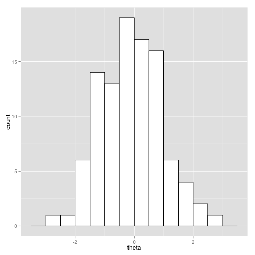
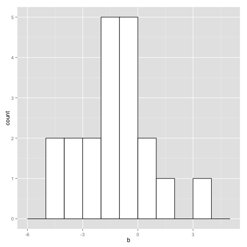

Item-response theory (IRT) is a model of educational testing that assigns each student an ability value and each question on a test a difficulty level (and optionally discimrinativeness among students).

## Reproducibility

To ensure the experiments are reproducible, all seeds are being set
explicitly.  These can be changed to explore variation in results with
different randomizations.

```{r
set.seed(3874656474);
```

## Data

In the simplest form, the data for an IRT model consists of

* $I$: number of test questions (integer, non-negative)
* $J$: number of students (integer, non-negative)
* $y_{i,j}$ : 1 if student $j$ answered question $i$ correctly ($\{0,1\}$)

## Basic Model (1PL)

The simplest form of IRT model is based on an ability parameter for students and a difficulty parameter for questions.

### Parameters (1PL)

* $\theta_j$ : ability for student $j$ (unconstrained)
* $b_i$ : difficulty of test question $i$ (unconstrained)

This form of IRT is called "one parameter logistic" (1PL) because there is a single parameter for each test question and because the logistic link function will be used.

### Likelihood (1PL)

The likelihood function uses the inverse of the logistic link function,

$$
\mbox{logit}^{-1}(u) = \frac{1}{1 + \exp(-u)},
$$

to convert the parameters into a probability that a given question is answered correctly by a given student,

$$
\mbox{Pr}[y_{i,j} = 1] = \mbox{logit}^{-1}(\theta_j - b_i)
$$

Expressed using sampling notation, the likelihood is

$$
y_{i,j} \sim \mbox{Bernoulli}\left(\mbox{logit}^{-1}(\theta_j - b_i)\right)
$$

Under the assumption that the data are independent and identically distributed (i.i.d.), the full likelihood function is

$$
p(y \ | \ \theta,b) = \prod_{i=1}^I \prod_{j=1}^J \mbox{Bernoulli}\left(y_{i,j} \, | \, \mbox{logit}^{-1}(\theta_j - b_i)\right)
$$


### Prior (1PL)

The prior on $\theta$ and $b$ is going to be an independent fixed
normal prior on both coefficient vectors.  The student abilities will
be given a unit normal prior
$$
\theta_j \sim \mbox{Normal}(0, 1)
$$
and the difficulties a prior centering the mean accuracy at around 73% accuracy (1 on the logit scale).  
$$
b_i \sim \mbox{Normal}(0, 2);
$$

In later sections we consider the issues of separability that arise in
any logistic regression and the additive invariance that leads to
non-identifiability when trying to define a maximum likelihood
estimate for IRT models.  We will also consider our preferred
resolution to both problems, a centered hierarchical prior for the
abilities $\theta$ and a free hierarchical prior on the problem
difficulties.  

### Joint (1PL)

The joint probability function is given by the prior times the likelihood, 
$$
p(\theta, b, y) = p(\theta) \, p(b) \, p(y \, | \, \theta, b),
$$
and by Bayes's rule, this is proportional to the posterior
$$
p(\theta, b \, | \, y) \propto  p(\theta) \, p(b) \, p(y \, | \, \theta, b).
$$
Stan models typically define log joint probability functions

#### 1PL as a sparse logistic legression

The 1PL IRT model may be reformulated as a traditional binary logistic
regression with an $I + J$ coefficient vector $\beta = (\theta,b)$ and
for each outcome $y_{i,j}$ an $(I+J)$-dimensional predictor vector
$x_{i,j}$ where $x_{i,j,i} = 1$, $x_{i,j, I + j} = 1$ and all other
coefficients are zero.  Then

$$
\mbox{Pr}[y_{i,j} = 1] 
= \mbox{logit}^{-1}(\beta^{\top} x_{i,j})
= \mbox{logit}^{-1}\left( \sum_{k=1}^{I+J} \beta_k x_{i,j,k} \right)
$$


### Simulating data in R (1PL)

To simulate the data using R, the model is simply evaluated in the forward direction from the priors.  Thus the model is known in advance to be well specified for the data, which is a very unrealistic assumption in practice, but a very convenient assumption for validating computational estimation behavior.


```r
inv_logit <- function(u) {
  return(1 / (1 + exp(-u)));
}

I <- 20;
J <- 100;
theta <- rnorm(J, 0, 1);
b <- rnorm(I, -1, 2);

y <- matrix(NA, I, J);
for (i in 1:I)
  y[i,] <- rbinom(J, 1, inv_logit(theta - b[i]));
```

The data can be summarized in histograms.


```r
library(ggplot2);
hist_theta_sim <-  
  ggplot(data=data.frame(theta), aes(theta)) + 
  geom_histogram(binwidth=0.5, colour="black", fill="white");
hist_theta_sim;
```

 

```r
hist_b_sim <-
  ggplot(data=data.frame(b), aes(b)) +
  geom_histogram(binwidth=1, colour="black", fill="white");
hist_b_sim;
```

 

### Coding model in Stan (1PL)

The following Stan program computes the model described in the
previous section.


The data block declares variables for the constant sizes $I$ and $J$ (constrained to be non-negative) and for the data variable $y$ (constrained to be 0 or 1).  

The parameters block declares vectors of size $I$ and $J$ for the parameters $b$ and $\theta$, with no constraints on their values.

The model block defines the joint probability function with separate statements for the priors and a loop for the likelihood with a logit-scaled Bernoulli distribution and a vectorized probability statement.

#### A note on vectorization

The vectorized form used in the model block for the 1PL model is equivalent to the fully unfolded form:


```r
for (i in 1:I)
  for (j in 1:J)
    y[i,j] ~ bernoulli_logit(theta[j] - b[i]);
```

#### A note on alternative parameterizations

Stan uses alternative parameterizations such as the logit-scaled Bernoulli for many of the distributions commonly used for generalized linear models.  They provide better efficiency because of fewer operations and derivatives and better robustness through more stable arithmetic.  The logit-scaled Bernoulli is defined as

$$
\mbox{BernoulliLogit}(u \, | \, \alpha)
= \mbox{Bernoulli}(u \, | \, \mbox{logit}^{-1}(\alpha)).
$$

Eliminating the direct application of the inverse logit function avoid losing precision due to subtraction and overflowing/underflowing due to exponentiation.  Because Stan works on the log scale, The logit-scaled Bernoulli allows whichever of 
$\log \mbox{logit}^{-1}(u)$
or 
$\log (1 - \mbox{logit}^{-1}(u))$
is needed to be calculated efficiently and with much higher precision.

### Fitting model in Stan (1PL)


#### Initialization

First the RStan library is loaded, then the model is compiled from its file.


```r
library(rstan);
```

```
## Loading required package: Rcpp
## Loading required package: inline
## 
## Attaching package: 'inline'
## 
## The following object is masked from 'package:Rcpp':
## 
##     registerPlugin
## 
## rstan (Version 2.6.0, packaged: 2015-02-06 21:02:34 UTC, GitRev: 198082f07a60)
```

```r
model <- stan_model("irt_1pl.stan");
```

```
## 
## TRANSLATING MODEL 'irt_1pl' FROM Stan CODE TO C++ CODE NOW.
## COMPILING THE C++ CODE FOR MODEL 'irt_1pl' NOW.
```

By default, RStan will initialize parameters uniformly on $(-2,2)$ in the unconstrained space.  Because there are no constraints on $\theta$
or $b$ in the model, this means $\theta$ and $b$ would have each of their elements initialized with a value drawn from $\mbox{Unif}(-2,2)$.  

RStan allows an optional initialization.  The initialization here just
explicitly mimics Stan's default in order to allow comparison with JAGS.


```r
init_fun <- function(chain_id) {
  return(list(theta=runif(J, -2, 2), b=runif(I, -2, 2)));
}
```

And then the <code>sampling</code> function is called on the model, given the data which is in the global environment, and the initialization function.


```r
fit <- sampling(model, data = c("I", "J", "y"), init=init_fun, refresh=2000, seed=1234);
```

```
## 
## SAMPLING FOR MODEL 'irt_1pl' NOW (CHAIN 1).
## 
## Iteration:    1 / 2000 [  0%]  (Warmup)
## Iteration: 1001 / 2000 [ 50%]  (Sampling)
## Iteration: 2000 / 2000 [100%]  (Sampling)
## #  Elapsed Time: 1.27312 seconds (Warm-up)
## #                0.924508 seconds (Sampling)
## #                2.19762 seconds (Total)
## 
## 
## SAMPLING FOR MODEL 'irt_1pl' NOW (CHAIN 2).
## 
## Iteration:    1 / 2000 [  0%]  (Warmup)
## Iteration: 1001 / 2000 [ 50%]  (Sampling)
## Iteration: 2000 / 2000 [100%]  (Sampling)
## #  Elapsed Time: 1.2867 seconds (Warm-up)
## #                0.935768 seconds (Sampling)
## #                2.22247 seconds (Total)
## 
## 
## SAMPLING FOR MODEL 'irt_1pl' NOW (CHAIN 3).
## 
## Iteration:    1 / 2000 [  0%]  (Warmup)
## Iteration: 1001 / 2000 [ 50%]  (Sampling)
## Iteration: 2000 / 2000 [100%]  (Sampling)
## #  Elapsed Time: 1.28228 seconds (Warm-up)
## #                1.78324 seconds (Sampling)
## #                3.06553 seconds (Total)
## 
## 
## SAMPLING FOR MODEL 'irt_1pl' NOW (CHAIN 4).
## 
## Iteration:    1 / 2000 [  0%]  (Warmup)
## Iteration: 1001 / 2000 [ 50%]  (Sampling)
## Iteration: 2000 / 2000 [100%]  (Sampling)
## #  Elapsed Time: 1.28022 seconds (Warm-up)
## #                0.995643 seconds (Sampling)
## #                2.27586 seconds (Total)
```

Next, the fit is printed out, with a subset of variables selected by name.


```r
options("width"=100);
print(fit, c(paste("b[", 1:10, "]"), paste("theta[", 1:10, "]"), "lp__"), 
      probs=c(0.10, 0.5, 0.90));
```

```
## Inference for Stan model: irt_1pl.
## 4 chains, each with iter=2000; warmup=1000; thin=1; 
## post-warmup draws per chain=1000, total post-warmup draws=4000.
## 
##              mean se_mean   sd     10%     50%     90% n_eff Rhat
## b[1]        -1.72    0.00 0.29   -2.09   -1.72   -1.36  4000    1
## b[2]        -2.05    0.01 0.32   -2.46   -2.04   -1.65  4000    1
## b[3]        -3.52    0.01 0.48   -4.17   -3.50   -2.93  4000    1
## b[4]        -1.80    0.01 0.29   -2.18   -1.79   -1.43  2920    1
## b[5]        -3.54    0.01 0.51   -4.20   -3.50   -2.91  4000    1
## b[6]        -1.02    0.00 0.25   -1.35   -1.02   -0.70  4000    1
## b[7]        -0.11    0.00 0.24   -0.42   -0.10    0.21  4000    1
## b[8]        -0.66    0.01 0.24   -0.97   -0.66   -0.34  2364    1
## b[9]        -2.96    0.01 0.41   -3.49   -2.94   -2.45  4000    1
## b[10]       -5.33    0.02 0.95   -6.60   -5.23   -4.19  4000    1
## theta[1]    -0.93    0.01 0.49   -1.55   -0.94   -0.29  4000    1
## theta[2]     0.62    0.01 0.54   -0.07    0.62    1.30  4000    1
## theta[3]     0.34    0.01 0.52   -0.32    0.33    1.00  4000    1
## theta[4]     0.06    0.01 0.52   -0.59    0.05    0.73  4000    1
## theta[5]    -1.39    0.01 0.50   -2.03   -1.39   -0.75  4000    1
## theta[6]    -0.69    0.01 0.49   -1.31   -0.68   -0.08  4000    1
## theta[7]     0.33    0.01 0.54   -0.35    0.31    1.02  4000    1
## theta[8]    -0.68    0.01 0.51   -1.32   -0.69   -0.03  4000    1
## theta[9]    -0.68    0.01 0.49   -1.31   -0.69   -0.05  4000    1
## theta[10]   -0.70    0.01 0.49   -1.33   -0.70   -0.06  4000    1
## lp__      -890.66    0.23 7.94 -901.08 -890.21 -880.96  1215    1
## 
## Samples were drawn using NUTS(diag_e) at Sun May 24 17:04:25 2015.
## For each parameter, n_eff is a crude measure of effective sample size,
## and Rhat is the potential scale reduction factor on split chains (at 
## convergence, Rhat=1).
```

```r
## --- fit-1pl-stan-compare ----
print(b[1:10], digits=2);
```

```
##  [1] -1.57 -1.76 -4.35 -2.14 -3.56 -1.19 -0.44 -0.83 -3.04 -4.78
```

```r
print(theta[1:10], digits=2);
```

```
##  [1] -1.73  2.09  0.34  0.43 -2.00 -1.36  0.28 -1.41 -1.35 -0.56
```

The $\hat{R}$ convergence diagnostics are all 1 (within the 2 decimal places printed), and the effective sample sizes are very high (2000 to 4000) compared to the total number of draws (4000).  This indicates very good mixing behavior for this simple model.  

The simulated values for $\theta$ and $b$ are as follows.


These are mostly recovered within their 95% posterior intervals.  The posterior is much wider for the student abilities ($\theta$) than question difficulties ($b$) because there five times as many students as questions---each question is evaluated with 100 students, whereas each student is evaluated with only 20 questions.

###  Separability (1PL)

Fitting maximum likelihood esitmates are problematic for 1PL for two reasons, separability and an additive invariance. 

The 1PL likelihood function is problematic because for any constant $c$, 

$$
p(y \, | \, \theta, b) = p(y \, | \, \theta + c, b - c)
$$

This means that the function $p(y \, | \, \theta, b)$ does not have a maximum value for $(\theta, b)$ given fixed data $y$ and hence there is no maximum likelihood estimator for the basic model. 

One way to identify the model is to reduce the degrees of freedom in the parameterization by fixing $\theta_1 = 0$.  This identifies the remaining free parameters, because the student abilities $\theta_2,\ldots,\theta_J$ and the question difficulties $b_1,\ldots,b_I$ are all determined relative to student 1's ability.
