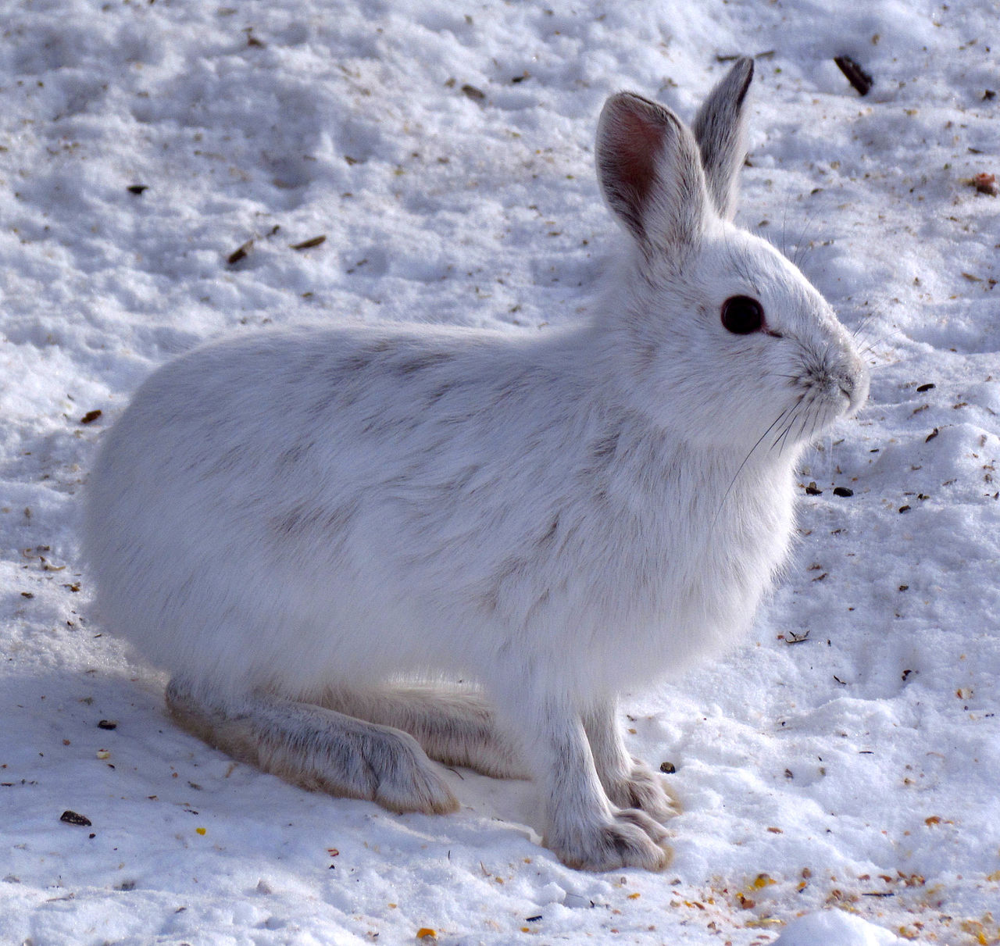

```{r setup, include=FALSE, echo=FALSE}
library(tufte)
library(reshape)
library(ggplot2)
library(rstan)
rstan_options(auto_write = TRUE)
options(mc.cores = parallel::detectCores(logical = FALSE))
knitr::opts_chunk$set(tidy = FALSE, cache.extra = packageVersion('tufte'))
knitr::opts_chunk$set(cache = TRUE)
knitr::opts_chunk$set(comment = '>')
options(htmltools.dir.version = FALSE)
options(digits = 2)
ggtheme_tufte <- function(base_size = 12, base_family = "") {
  theme(plot.background =
          element_rect(fill = "#fffff8",
                       colour = "#fffff8",
                       size = 0.5,
                       linetype = "solid"),
        plot.margin=unit(c(1, 1, 0.5, 0.5), "lines"), 
        panel.background =
          element_rect(fill = "#fffff8",
                       colour = "#fffff8",
                       size = 0.5,
                       linetype = "solid"),
        panel.grid.major = element_blank(),
        panel.grid.minor = element_blank(),
        legend.box.background =
          element_rect(fill = "#fffff8",
                       colour = "#fffff8",
                       linetype = "solid"), 
        axis.ticks = element_blank(),
        axis.text = element_text(family = "Palatino", size = 16),
        axis.title.x = element_text(family = "Palatino", size = 20,
                                    margin = margin(t = 15, r = 0, b = 0, l = 0)),
        axis.title.y = element_text(family = "Palatino", size = 20,
                                    margin = margin(t = 0, r = 15, b = 0, l = 0)),
        strip.background = element_rect(fill = "#fffff8",
                                        colour = "black",
                                        linetype = "solid"),
        legend.text = element_text(family = "Palatino", size = 16),
        legend.title = element_text(family = "Palatino", size = 16),
        legend.background = element_rect(fill = "#fffff8",
                                        colour = "#fffff8",
                                        linetype = "solid"),
        legend.key = element_rect(fill = "#fffff8",
                                        colour = "#fffff8",
                                        linetype = "solid")
  )
}
printf <- function(msg = "%5.3f", ...) {
  cat(sprintf(msg, ...))
}
```


## Abstract

Lotka and Volterra provided parameteric differential equations that characterize the dynamics of the populations of predator and prey species.   A statistical model to account for measurement error and unexplained variation uses the deterministic solutions to the Lotka-Volterra equations as expected population sizes.  Stan is used to encode the model and perform full Bayesian inference.  The model is fit to Canadian lynx^[*Predator*: Canadian lynx

<span style="font-size:70%; float:right">&copy; 2009, Keith Williams, CC-BY 2.0</span>
] and snowshoe hare^[*Prey*: snowshoe hare

<span style="font-size:70%; float:right">&copy; 2013, D. Gordon E. Robertson, CC-BY SA 3.0</span>
] populations between 1900 and 1920, based on the number of pelts collected annually by the Hudson Bay Company.  Posterior predictive checks for replicated data show the model fits this data well.  Full Bayesian inference may be used to estimate future (or past) populations.


# Lynxes and Hares in Canada

> The rise and fall in numbers of snowshoe hares and Canada lynx was observed more than two hundred years ago by trappers working for Hudson’s Bay Company, which was once heavily involved in the fur trade. In the early 20th century, records of the number of lynx and hare pelts traded by Hudson’s Bay were analyzed by biologist Charles Gordon Hewitt.  *(Kara Rogers, 2011, Encyclopedia Brittanica Blog)*

The species of interest are

* [snowshoe hares](https://en.wikipedia.org/wiki/Snowshoe_hare), an hervivorous cousin of rabbits, and
* [Canadian lynxes](https://en.wikipedia.org/wiki/Canada_lynx), a feline predator whose diet consists largely of snowshoe hares.

Hewitt (1921) provides plots of the number of from pelts collected by the Hudson's Bay Company, the largest fur trapper in Canada, between the years of 1821 and 1914.^[Graph from (Hewitt 1921) showing hare, lynx, and wolverine fluctuations based on pelts captured by the Hudson's Bay Company.
<br /> &nbsp; <br />

<span style="float:right; font-size: 70%">&copy; Scribner's Sons 1921</span>
]
Hewitt's discussion is also fascinating as to the nature of plagues, lynx migrations, and other factors affecting the populations other than their relative sizes, and factors affecting measurement such as starving lynx being easier to capture.  The models we consider here for illustrative purposes will not consider any of these factors, though they could be extended to do so through the usual strategy of the inclusion of covariates.  Hewitt also discusses many other species;  hares and lynxes occupy only a small part of a single chapter.

Howard (2009) provides numerical data for the number of pelts collected by the Hudson's Bay Company in the years 1900-1920, which we have included in comma-separated value (CSV) form in the case study.

```{r}
lynx_hare_df <-
  read.csv("hudson-bay-lynx-hare.csv", comment.char="#")
```

```{r echo=FALSE, fig.cap = "First and last rows of the long form data."}
lynx_hare_melted_df <- melt(as.matrix(lynx_hare_df[, 2:3]))
colnames(lynx_hare_melted_df) <- c("year", "species", "pelts")
lynx_hare_melted_df$year <-
  lynx_hare_melted_df$year +
  rep(1899, length(lynx_hare_melted_df$year))
knitr::kable(lynx_hare_melted_df[c(1:2, 21:22, 41:42), ],
             full_width = FALSE,
             col.names = c('year', 'species', 'pelts in thousands'),
             align = c('r', 'c', 'r'),
             caption = "Example rows (with their indexes) from the long-form data frame
                        for number of pelts taken by the Hudson Bay Company
                        in the years 1900 to 1920 (in thousands)."  
  ) 
```

```{r echo=FALSE, fig.margin = TRUE, fig.cap="Plot of the lynx and hare populations over time."}
population_plot2 <-
  ggplot(data = lynx_hare_melted_df,
         aes(x = year, y = pelts, color = species)) +
  geom_line(size = 0.75) +
  geom_point(size = 1.5) +
  ylab("pelts (thousands)") +
  ggtheme_tufte()
population_plot2
```

```{r echo=FALSE, fig.margin=TRUE, fig.cap="Plot of lynx pelts versus hare pelts over time.  The ups and downs of the individual plots over times is more revealing as a joint plot.  Volterra noticed the spiral pattern was stable and could be modeled with a pair of simple differential equations."}
population_plot1 <-
  ggplot(data = lynx_hare_df,
         aes(x = Lynx, y = Hare, color = Year)) +
  geom_path(size = 0.75) +
  geom_point(size = 1.5) +
  xlab("lynx pelts (thousands)") +
  ylab("hare pelts (thousands)") +
  ggtheme_tufte()
population_plot1
```

The plot makes it clear that the spikes in the lynx population lag those in the hare population.  When the populations are plotted against one another over time, the population dynamics orbit in an apparently stable pattern.  Volterra (1926) noticed this pattern and realized that it could be modeled with a stable pair of differential equations.

# The Lotka-Volterra Equations

The Lotka-Volterra equations (Volterra 1926, 1927; Lotka 1925) are based on the assumptions that

* the predator population intrinsically shrinks,
* the prey population intrinsically grows,
* larger prey population leads to larger predator population, and
* larger predator population leads to smaller prey populations.

Together, these dynamics lead to a cycle of rising and falling populations.  With a low lynx population, the hare population grows.  As the hare population grows, it allows the lynx population to grow.  Eventually, the lynx population is large enough to start cutting down on the hare population.  That in turn puts downward pressure on the lynx population.  The cycle then resumes from where it started.

The Lotka-Volterra equations (Volterra 1926, 1927; Lotka 1925) are a pair of first-order differential equations describing the population dynamics of a pair of species, one predator and one prey.^[Solutions to the Lotka-Volterra equations time plotted as predator vs. prey populations;  the temporal trajectory of populations forms a stable orbit when plotted in two dimensions (Volterra 1926). 
<br /> &nbsp; <br />

<span style="float:right; font-size:60%">&copy; 1926, Nature Publishing Group</a>
]


* $u(t) \geq 0$ is the population size of the prey species at time $t$, and
* $v(t) \geq 0$ is the population size of the predator species.

Volterra modeled the temporal dynamics of the two species (i.e., population sizes over times) in terms of four parameters, $\alpha, \beta, \gamma, \delta > 0$, as

$$
\begin{eqnarray}
\frac{\mathrm{d}}{\mathrm{d}t} u
& = &  (\alpha - \beta v) u
& = & \alpha u - \beta u v
\\[6pt]
\frac{\mathrm{d}}{\mathrm{d}t} v
& = &  (-\gamma + \delta \, u) \, v
& = & -\gamma v + \delta uv
\end{eqnarray}
$$

As usual in writing differential equations, $u(t)$ and $v(t)$ are rendered as $u$ and $v$ to simplify notation.


## Positivitity constraint and extinction

As population measures, the values of $u(t)$ and $v(t)$ should be non-negative.  Nothing in the differential equations here explicitly enforces positivity.  Nevertheless, as long as the initial populations are non-negative, i.e., $u(0) \geq 0$ and $v(0) \geq 0$, the values $u(t)$ and $v(t)$ for other times $t$ must also be positive.  This result is easy to see from the form of the differential equations, which take the change in each population to be a factor of the population size itself.  

## Behavior in the limit

One way to understand systems of equations is to consider their limiting behavior.  Here, there are four possible limiting behaviors

1. If both populations begin at size zero, they remain that way.

2. If only the prey population begins at zero, the predator population decays toward an asymptote at zero.

3. If only the predator population begins at zero, the prey population grows without bound.

4. If neither population is initially zero, the population sizes will oscillate in a fixed pattern indefinitely.

In the oscillating cases, the populations may be arbitrarily close to zero, but they will never get to zero.  

The fact that we can have very small fractional population size estimates is unrealistic in multiple ways.  First and most obviously, animals don't come in fractions.  But perhaps more importantly, random events such as accidents can drive a very small population extinct.


# Measurement Error and Unexplained Variation

The Lotka-Volterra model is deterministic.  Given the system parameters and the initial conditions, the solutions to the equations are fully determined.  Population measurements are not so well behaved that they exactly follow the model.  As we saw from the plots, the measurements do roughly follow the model for various ranges of parameters, but there is residual error that cannot be explained by the model.

There are factors that impact predator and prey population size other than the current population size.  There are variable environmental effects, such as annual weather, which will vary from season to season and year to year and affect population sizes.  Infectious diseases occasionally spread through a population, reducing its size (Hewitt 1921).  There are also more long-term environmental factors such as carrying capacity.^[Carrying capacity is roughly the maximum population that an environment can sustain.  It is often modeled in the system dynamics as an asymptote on population size.]  In addition to factors that affect population which are not modeled, there is typically noise in the measurements.  

In this particular case, we cannot even measure the population directly.  Instead, pelts are used as a proxy for population sizes.^[It would be possible to combine population models such as these with mark-recapture population models.]  Hewitt (1921) further noted that animals are easier to trap when food is scarce, making the population measurements dependent on the population size.  Even the exact number of pelts taken is likely to be only approximate, as they were collected in a range of locations over an entire season.  Here, the number is only recorded to the closest 100.^[Rounding can be treated explicitly by allowing the true value to be a parameter;  for instance if rounding is to the closest 100, the parameter can be modeled as uniform over $\pm 50$ of the true measured value or even greater if the measurement on which the rounding was based may be in error.]

# Solving the inverse problem

For a given legal value of the model parameters and initial state,  the Lotka-Volterra model predicts population dynamics into the future (and into the past).  But given noisy data about population dynamics, how do we solve the inverse problem, that of inferring the values of model parameters consistent with the data?  The general approach in Bayesian statistics is somewhat counterintuitive, as it involves formulating the forward model then using general principles to solve the inverse problem.   Specifically, it requires specifying what we know about the parameters before seeing the data, and what we expect the data to look like given parameter values.  Mathematically, this is done through a prior $p(\theta)$ over the sequence of parameters $\theta$ that encapsulates our knowledge of the parameters before seeing the data along with a sampling distribution $p(y|\theta)$ that characterizes the distribution of observable data $y$ given parameters $\theta$.^[The sampling distribution is called a likelihood function when considered as a function of parameters $\theta$ for fixed data $y$.] 

Bayes's rule gives us a general solution to the inverse problem in the form of a posterior probability function $p(\theta | y)$.^[The derivation of Bayes's rule for parameters $\theta$ and observed data $y$ is $$ \begin{array}{rcl} p(\theta | y) & = & \displaystyle \frac{p(\theta, y)}{p(y)} \\[8pt] & = & \displaystyle \frac{p(y | \theta) \, p(\theta)}{p(y)} \\[8pt] & = & \displaystyle \frac{p(y | \theta) \, p(\theta)}{\int p(y | \theta) \, p(\theta) \, \mathrm{d}\theta} \\[8pt] & \propto & p(y | \theta) \, p(\theta). \end{array} $$]


# Noise model for Lotka-Volterra dynamics

## A linear regression analogy

Like a simple linear regression, or non-linear generalized linear model, the trick is to treat the underlying determinstic model as providing a value which is expected to have error from both measurement and unexplained variance due to the simplifications in the scientific model.  Consider the typical formulation of a linear regression, where $y_n$ is an observable scalar outcome, $x_n$ is a row vector of unmodeled predictors, $\beta$ is a coefficient vector parameter, and $\sigma > 0$ is the error scale, 

$$
\begin{eqnarray}
y_n & = & x_n \beta + \epsilon_n
\\[6pt]
\epsilon_n & \sim & \mbox{Normal}(0, \sigma)
\end{eqnarray}
$$

The deterministic part of the equation is the linear predictor $x \beta$.  The stochastic error term, $\epsilon_n$, gets a normal distribution located at zero with scale parameter $\sigma > 0$ (this error model ensures that the maximum likelihood value for $\beta$ is at the least squares solution).  We typically formulate this model without the latent error variable $\epsilon_n$ as follows,^[The latent error variable may be defined as  $\epsilon_n = y_n - x_n \beta$.]

$$
y_n \sim \mbox{Normal}(x_n \beta, \sigma).
$$


## Lotka-Volterra error model

The data $y_i$ consists of measurements of the prey $y_{i, 1}$ and predator $y_{i, 2}$ populations at times $t_i$.  The Lotka-Volterra equations will replace the determinsitic parts of the linear regression equations.

The true population sizes at time $t = 0$ are unknown---we only have measurements $y^{\rm init}_1$ and $y^{\rm init}_2$ for it.  The true initial population sizes at time $t = 0$ will be represented by a parameter $z^{\mathrm init}$, so that

$$
z^{\mathrm init}_1 = u(t = 0)
\ \ \ \mathrm{and} \ \ \
z^{\mathrm init}_2 = v(t = 0).
$$

Next, let $z_1, \ldots, z_N$ be the solutions to the Lotka-Volterra differential equations at times $t_1, \ldots, t_N$ given initial conditions $z(t = 0) = z^{\mathrm init}$ and parameters $\theta = (\alpha, \beta, \gamma, \delta)$.  Each $z_n$ is a pair of prey and predator population sizes at the specified times,

$$
z_{n, 1} = u(t_n)
\ \ \ \mathrm{and} \ \ \
z_{n, 2} = v(t_n)
$$

The $z_n$ are random variables, but they are deterministic functions of other random variables: the initial system state $z^{\mathrm init}$ and the system parameters $\alpha, \beta, \gamma, \delta$.

The observed data is the form of measurements $y^{\rm init}$ of the initial population of prey and predators, and subsequent measurements $y_n$ at times $t_n$, where $y^{\mathrm init}$ and the $y_n$ consist of a pair of measured population sizes, for the prey and predator species.

Putting this all together, the measurements $y^{\rm init}$ and $y_n$ are of an underlying latent population sizes $z^{\mathrm init}$ and $z_n$.  

## Multiplicate error and the lognormal distribution

It is natural for positive-only parameters to log transform them so that they are no longer constrained to be positive.  The simplest assumption we can make here is to take the error to be additive on the log scale, just as in a linear regression.

$$
\begin{eqnarray}
\log y_{n, k} & = & \log z_{n, k} + \epsilon_{n, k}
\\[6pt]
\epsilon_{n, k} & \sim & \mathrm{Normal}(0, \sigma_k)
\end{eqnarray}
$$

where the $z_n$ are the solutions to the Lotka-Volterra equations at times $t_1, \ldots, t_N$ given initial population $z^{\mathrm init}$.  The prey and predator populations have error scales (on the log scale) of $\sigma_1$ and $\sigma_2$.

With log-transformed measurements with additive errors, transforming back to the natural scale leads to multiplicative errors,

$$
\begin{array}{rcl}
y_{n, k} & = & \exp(\log z_{n, k} + \epsilon_{n, k})
\\[4pt]
         & = & z_{n, k} \, \exp(\epsilon_{n,k})
\end{array}
$$

with $\exp(\epsilon_{n,k})$ being constrained to be positive, so that the product is positive.  In other words, rather than the measurement being plus or minus some value, it's plus or minus some percentage of the total.

This transform and error multiplicative error model are so common that they are jointly known as the lognormal distribution, so that we can simplify the above notation as we did with linear regression and write

$$
y_{n, k} \sim \mathsf{LogNormal}(z_{n, k}, \sigma_n).
$$
if $\log y_{n, k} \sim \mathsf{Normal}(z_{n, k}, \sigma_n)$.


# Weakly informative priors

The only remaining part of the model to formulate is what we know about the parameters.  In general, we^[The Stan Development Team, in a Wiki on  [prior choice recommendations](https://github.com/stan-dev/stan/wiki/Prior-Choice-Recommendations).] recommend at least weakly informative priors on parameters.   In practice, weakly informative priors inform the scale of the answer, but not the exact value.  That means that in order to formulate such priors, we need to know the rough scale on which to expect an answer.  Because this model is well understood and widely used, as is the basic behavior of predator and prey species such as lynxes and hares, the parameter ranges for the Lotka-Volterra model leading to stable and realistic population oscillations are well known.

## Priors for system parameters

For the parameters, recall that $\alpha$ and $\gamma$ are multipliers of $u$ and $-v$ respectively in the state equations, whereas $\beta$ and $\delta$ are multipliers of the product $u \, v$.  Combined with the fact that the scale of $u$ and $v$ are roughly 10 as the data has been encoded, leads to a prior scaling of the former parameters by the same factor.  

$$
\begin{eqnarray}
\alpha, \gamma & \sim & \mathrm{Normal}(1, 0.5)
\\[6pt]
\beta, \delta & \sim & \mathrm{Normal}(0.05, 0.05)
\end{eqnarray}
$$

## Prior for noise scale

The noise scale is proportional, so the following prior should be weakly informative, as a value smaller than 0.1 or larger than 1 would be unexpected. Because values are positive, this prior adopts the lognormal distribution.^[A lognormal prior on $\sigma$ is not consistent with zero values of $\sigma$, but we do not expect zero values of $\sigma$ here as we do not expect this model to be particularly accurate as formulated.]  Another reasonable prior choice would be a broad half normal.^[An interval prior with hard boundaries is not recommended as it may bias results if the data is compatible with results near the boundary.]

$$
\sigma \sim \mathrm{LogNormal}(\log(0.5), 1)
$$

```{r echo=FALSE, fig.margin=TRUE, fig.cap = "Plot of lognormal(log(0.5), 0.5) prior.  This prior density is not consistent with a value of zero, as the density approaches zero very rapidly as the value approaches zero.  It is consistent with values only slightly larger than zero."}
ggplot(data.frame(x = c(0, 6)), aes(x = x)) +
  stat_function(fun = function(x) dlnorm(x, meanlog = log(0.5), sdlog = 1)) +
  scale_y_continuous(name = expression(p(sigma))) +
  scale_x_continuous(name = expression(sigma)) +
  ggtheme_tufte() +
  theme(axis.text.y = element_blank())
```

The 95% interval will be roughly 1/e and e.  

Then, for the initial population of predator and prey, the following priors are weakly informative.

$$
z^{\mathrm init}_1, \ z^{\mathrm init}_2 \ \sim \ \mathsf{LogNormal}(\log(25), 1)
$$

```{r echo=FALSE, fig.margin=TRUE, fig.cap = "Plot of lognormal(log(10), 1) prior.  This prior suffices for both predator and prey sizes."}
ggplot(data.frame(x = c(0, 150)), aes(x = x)) +
  stat_function(fun = function(x) dlnorm(x, meanlog = log(25), sdlog = 1))+
  scale_y_continuous(name = expression(p(z^init), )) +
  scale_x_continuous(name = expression(z^init)) +
  ggtheme_tufte() +
  theme(axis.text.y = element_blank())
```


# Stan Code


## Coding the system dynamics

Whenever a system of differential equations is involved, the system equations must be coded as a Stan function.  In this case, the model is relatively simple as the state is only two dimensional and there are only four parameters.  Stan requires the system to be defined with exactly the signature defined here for the function <code>dz_dt()</code>.  The first argument is for time, which is not used here because the Lotka-Voltarra equations are not time-dependent.  The second argument is for the system state, and here it is coded as an array
$z = (u, v)$.  The third argument is for the parameters of the equation, of which the Lotka-Voltarra equations have four, which are coded as $\theta = (\alpha, \beta, \gamma, \delta)$.  The fourth and fifth argument are for data constants, but none areneeded here, so these arguments are unused.

```
  real[] dz_dt(real t,       // time (unused)
               real[] z,     // system state
               real[] theta, // parameters
               real[] x_r,   // data (unused)
               int[] x_i) {
    real u = z[1];
    real v = z[2];

    real alpha = theta[1];
    real beta = theta[2];
    real gamma = theta[3];
    real delta = theta[4];

    real du_dt = (alpha - beta * v) * u;
    real dv_dt = (-gamma + delta * u) * v;

    return { du_dt, dv_dt };
  }
```

After unpacking the variables from their containers, the derivatives of population with respect to time are defined just as in the mathematical specification.  The return value uses braces to construct the two-element array to return, which consists of the derivatives of the system components with respect to time,

$$
\frac{\mathrm{d}}{\mathrm{d}t} z
\ = \ \frac{\mathrm{d}}{\mathrm{d}t} (u, v)
\ = \ \left( \frac{\mathrm{d}}{\mathrm{d}t} u, \, \frac{\mathrm{d}}{\mathrm{d}t} v \right).
$$

The data and parameters are coded following their specifications.

```
data {
  int<lower = 0> N;         // num measurements
  real ts[N];               // measurement times > 0
  real y_init[2];           // initial measured population
  real<lower = 0> y[N, 2];  // measured population at measurement times
}
parameters {
  real<lower = 0> theta[4];  // theta = { alpha, beta, gamma, delta }
  real<lower = 0> z_init[2];     // initial population
  real<lower = 0> sigma[2];  // measurement errors
}
```

The solutions to the Lotka-Volterra equations for a given initial state $z^{\mathrm init}$ are coded up as transformed parameters.  This will allow them to be used in the model and inspected in the output.  It also makes it clear that they are all functions of the initial population and parameters (as well as the solution times).

```
transformed parameters {
  // population for remaining years
  real z[N, 2]
    = integrate_ode_rk45(dz_dt, z_init, 0, ts, theta,
                         rep_array(0.0, 0), rep_array(0, 0),
                         1e-6, 1e-5, 1e3);
}
```

The Runge-Kutta 4th/5th-order solver is specified here for efficiency (with suffix <code>_rk45</code>) because the equations are not stiff in the parameter ranges encountered for this data.   The required real and integer data arguments in the second line are both given as size-zero arrays.  The last line provides relative and absolute tolerances, along with the maximum number of steps allowed in the solver.  For further efficiency, the tolerances for the differential equation solver are relatively loose for this example; usually tighter tolerances are required (smaller numbers).

If the solver runs into stiffness (the symptom of which is very slow iterations that may appear to be hanging), it is best to switch to the backward-differentiation formula solver, called with <code>integrate_ode_bdf</code>. The Runge-Kutta solver is twice as fast as the BDF solver for this problem on this data.

With the solutions in hand, the only thing left are the prior and likelihood.  As with the other parts of the model, these directly follow the notation in the mathematical specification of the model.

```
model {
  // priors
  sigma ~ normal(0, 0.5);
  theta[1:2] ~ normal(0, 1);
  theta[3:4] ~ normal(0, 0.2);
  z_init[1] ~ normal(10, 10);
  z_init[2] ~ normal(50, 50);

  // likelihood
  y_init ~ lognormal(log(z_init), sigma);
  for (k in 1:2)
    y[ , k] ~ lognormal(log(z[, k]), sigma[k]);
}
```

## Fitting the Hudson Bay Company lynx-hare data

First, the data is setup in a form suitable for Stan.

```{r}
N <- length(lynx_hare_df$Year) - 1                   # num observations after first
ts <- 1:N                                            # observation times just years
y_init <- c(lynx_hare_df$Hare[1], lynx_hare_df$Lynx[1])  # first observation
y <- as.matrix(lynx_hare_df[2:(N + 1), 2:3])         # remaining observations
y <- cbind(y[ , 2], y[ , 1]);                        # reverse order
lynx_hare_data <- list(N, ts, y_init, y)
```

Next, the model is translated to C++ and compiled.

```{r results="hide"}
model <- stan_model("lotka-volterra.stan")
```

Finally, the compiled model and data are used for sampling.  Stan's default settings are sufficient for this data set and model.

```{r results="hide"}
fit <- sampling(model, data = lynx_hare_data,
                seed=123)
```

The output can be displayed in tabular form, here limited to the median (0.5 quantile) and 80% interval (0.1 and 0.9 quantiles), and restricted to the main quantities of interest

```{r}
print(fit, pars=c("theta", "sigma", "z_init"), 
      probs=c(0.1, 0.5, 0.9), digits = 3)
```

The R-hat values are all near 1, which is consistent with convergence.  The effective sample size estimates for each parameter are sufficient for inference.  Thus we have reason to trust this fit.

The expected values `z` are unlike the replicated draws `y_rep` in two ways.  First, their posterior has much lower variance and much narrower 80% intervals.  This is to be expected, as the `y_rep` additional takes into account measurement and unexplained variance, whereas `z` only takes into account parameter estimation uncertainty.  Second, the mean values of `z` are lower than the corresponding values of `y_rep`.  This is because `y_rep` is adding a lognormal error term, which has a positive expectation as it is constrained to be positive;  this positivity is also a factor in the fits that are derived for `z`.


## Comparing the fitted model to data

Using a non-statistically motivated error term and optimization, Howard (2009, Figure 2.10) provides the following approximate point estimates for the model parameters based on the data.
$$
\alpha^* = 0.55, \ \
\beta^* = 0.028, \ \
\gamma^* = 0.84, \ \
\delta^* = 0.026
$$

Our model produced the following point estimates based on the posterior mean,^[The posterior mean minimizes expected squared error, whereas posterior medians minimize expected absolute error.  Here, the mean and median are the same to within MCMC standard error.]

$$
\hat{\alpha} = 0.54, \ \
\hat{\beta} = 0.028, \ \
\hat{\gamma} = 0.80, \ \
\hat{\delta} = 0.024,
$$

which are quite close to Howard's estimates. 

## Inference for population sizes

One inference we would like to make from our data is the size of the lynx and hare populations over time.  Howard (2009)
plugs in optimization-derived point estimates to derive population predictions.  

Rather than plugging in point estimates to get point predictions, we will follow the fully Bayesian approach of adjusting for uncertainty.  This uncertainty takes two forms in inference.  First, there is estimation uncertainty, which is fully characterized by the joint posterior density $p(\alpha, \beta, \gamma, \delta, z^{\mathrm init}, \sigma \mid y)$.  In well-behaved models in which the data is broadly consistent with the prior and likelihood, estimation uncertainty is reduced by larger samples; as more data is available, the posterior will concentrate  

The second form of uncertainty is the observation error and unexplained variation, which are both rolled into a single sampling distribution, $\log y_n \sim \mathsf{Normal}(\log z_n, \sigma)$.  As in the Stan implementation, $z_n = (u_n, v_n)$ is the solution to the differential equation conditioned on the parameters $\theta = (\alpha, \beta, \gamma, \delta, \sigma)$ and initial state $z^{\mathrm init}$.  

## Posterior predictive checks

We use posterior predictive checks to evaluate how well our model fits the data on which it is trained.  The basic idea is to take the posterior for the fitted model and use it to predict what the data should've looked like.  That is, we will be replicating new $y$ values that parallel the actual observations $y$.  Becuase they are replicated values, we write them as as $y^{\mathrm{rep}}$.  The distribution of these replicated values is given by the posterior predictive distribution, 

$$
p(y^{\mathrm{rep}} | y)
\ = \
\int p(y^{\mathrm{rep}} | \theta) \ p(\theta | y) \ \mathrm{d}\theta.
$$

where $\theta = (\alpha, \beta, \gamma, \delta, z^{\mathrm init}, \sigma)$ is the vector of parameters for the model.  Our two forms of uncertainty are represented in the two terms in the integral.  The first is the sampling distribution for the replications, $p(y^{\mathrm rep} | \theta)$, which is the distribution of observations $y^{\mathrm rep}$ given parameters $\theta$.  This term encapsulates the unexplained variance and measurement error. The second term is the posterior $p(\theta | y)$, which encapsulates our uncertainty in our parameter estimates $\theta$ given the observations $y$.  What the integral is telling us is that we're calculating a weighted average of the sampling distribution, with weights given the posterior.  In statistical terms, we are calculating an expectation of a function of the parameters, $f(\theta) = p(y^{\mathrm rep} | \theta)$, over  the posterior $p(\theta | y)$, which can be written concisely as a conditional expectation,

$$
p(y^{\mathrm{rep}} | y)
\ = \
\mathbb{E}\!\left[ p(y^{\mathrm{rep}} | \theta) \ \big| \ y \right].
$$

As with other posterior expectations, the Bayesian point estimate is given by a simple average over simulated values, where $y^{\mathrm{rep}(m)}$ is just the result of simulating the value of $y^{\mathrm{rep}}$ according to the generative model based on parameter draw $\theta^{(m)}$.

The posterior predictive estimates of the dynamics are shown below, along with the raw data on number of pelts collected.

```{r echo=FALSE, fig.margin = TRUE, fig.cap = "Posterior means plotted with 50% posterior intervals along with the measured data."}
z_init_draws <- extract(fit)$z_init
z_draws <- extract(fit)$z
y_init_rep_draws <- extract(fit)$y_init_rep
y_rep_draws <- extract(fit)$y_rep
predicted_pelts <- matrix(NA, 21, 2)
min_pelts <- matrix(NA, 21, 2)
max_pelts <- matrix(NA, 21, 2)
for (k in 1:2) {
  predicted_pelts[1, k] <- mean(y_init_rep_draws[ , k])
  min_pelts[1, k] <- quantile(y_init_rep_draws[ , k], 0.25)
  max_pelts[1, k] <- quantile(y_init_rep_draws[ , k], 0.75)
  for (n in 2:21) {
    predicted_pelts[n, k] <- mean(y_rep_draws[ , n - 1, k])
    min_pelts[n, k] <- quantile(y_rep_draws[ , n - 1, k], 0.25)
    max_pelts[n, k] <- quantile(y_rep_draws[ , n - 1, k], 0.75)
  }
}

lynx_hare_melted_df <- melt(as.matrix(lynx_hare_df[, 2:3]))
colnames(lynx_hare_melted_df) <- c("year", "species", "pelts")
lynx_hare_melted_df$year <-
  lynx_hare_melted_df$year +
  rep(1899, length(lynx_hare_melted_df$year))

Nmelt <- dim(lynx_hare_melted_df)[1]
lynx_hare_observe_df <- lynx_hare_melted_df
lynx_hare_observe_df$source <- rep("measurement", Nmelt)

lynx_hare_predict_df <-
  data.frame(year = rep(1900:1920, 2),
             species = c(rep("Lynx", 21), rep("Hare", 21)),
             pelts = c(predicted_pelts[, 2],
                       predicted_pelts[, 1]),
             min_pelts = c(min_pelts[, 2], min_pelts[, 1]),
             max_pelts = c(max_pelts[, 2], max_pelts[, 1]),
             source = rep("prediction", 42))

lynx_hare_observe_df$min_pelts = lynx_hare_predict_df$min_pelts
lynx_hare_observe_df$max_pelts = lynx_hare_predict_df$max_pelts

lynx_hare_observe_predict_df <-
  rbind(lynx_hare_observe_df, lynx_hare_predict_df)

population_plot2 <-
  ggplot(data = lynx_hare_observe_predict_df,
         aes(x = year, y = pelts, color = source)) +
  facet_wrap( ~ species, ncol = 1) +
  geom_ribbon(aes(ymin = min_pelts, ymax = max_pelts),
	      colour = NA, fill = "black", alpha = 0.1) +
  geom_line() +
  geom_point() +
  ylab("pelts (thousands)") +
  ggtheme_tufte()
population_plot2
```

This posterior predictive check shows that the model fit is consistent with the data, with around 50% of the data points falling within the 50% intervals.


# How large are the populations?

Going on the assumption that the number of pelts collected is proportional to the population, we only know how the relative sizes of the populations change, not their actual sizes.

This model could be combined with a mark-recapture model to get a better handle on the actual population size.  Mark-recapture gives you an estimate of actual numbers and the Lotka-Volterra model would provide information on relative change in the predator and prey populations.

# Extensions

The Lotka-Volterra model is easily extended for realistic applications in several ways.

1.  Predictors can be rolled into the system state to take into the dynamnics to account for things like the correlation of populations with the abundance of food.

2.  The model may be extended beyond two species.  The dynamics for each species will reflect that it may stand in predator-prey relations to multiple other species.

3.  Additional data for population observations may be included, such as adding a mark-recapture model for tag-release-recapture data of populations.


# Exercises

1.  Extend predictions another 50 years into the future and plot as in the last plot.  This can be done by extending the solution points in the transformed parameters, but is more efficiently done in the generated quantities block.

2.  Write a Stan model to simulate data from this model.  First simulate parameters from the prior (or pick ones consistent with the priors).  Then simulate data from the parameters.  Finally, fit the model in Stan and compare the coverage as in the last plot in the case study.

3.  Suppose that several of the measurements are missing.  Write a Stan program that uses only the observed measurements.  How robust is the fit to missing a few data points?

4.  Write a Stan model that predicts the population at finer-grained intervals than a year (such as every three months).  Can the model be formulated to only use the yearly data?  Do the smoother plots for predicted populations make sense?  Does this fit better or worse than the original model?

4.  Replace the lognormal error with a simple normal error model.  What does this do to the `z` estimates and to the basic parameter estimates?  Which error model fits better?


# References

* Hewitt, C. G. (1921) [*The Conservation of the Wild Life of Canada*](https://books.google.com/books?id=8hVDAAAAIAAJ). Charles Scribner's Sons.

* Howard, P. (2009). [Modeling Basics](http://www.math.tamu.edu/~phoward/m442/modbasics.pdf). Lecture Notes for Math 442, Texas A&M University.

* Lotka, A. J. (1925). *Principles of physical biology*. Baltimore: Waverly.

* Rogers, K. (2011) [The rise and fall of the Canada lynx and snowshoe hare]( http://blogs.britannica.com/2011/06/rise-fall-canada-lynx-snowshoe-hare/). *Encyclopedia Brittanica Blog*.

* Volterra, V. (1926). Fluctuations in the abundance of a species considered mathematically. *Nature*, 118(2972), 558-560.

* Volterra, V. (1927). *Variazioni e fluttuazioni del numero d'individui in specie animali conviventi*. C. Ferrari.


<br />

## Appendix

  **full Stan model here**


## Appendix: Session information

```{r}
sessionInfo()
```

<br />

## Appendix: Licenses

* <span style="font-size:85%">Code &copy; 2017--2018, Columbia University, licensed under BSD-3.</span>
* <span style="font-size:85%">Text &copy; 2017--2018, Bob Carpenter, licensed under CC-BY-NC 4.0.</span>
