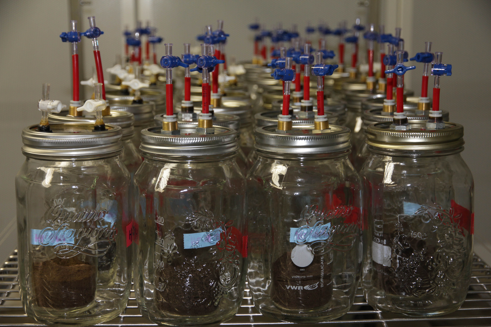
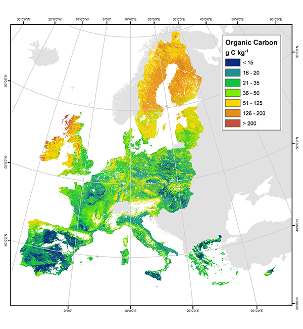

### Overview

#### Experimental Data

<p>Soil incubation experiments are used to estimate parameters of physical models of carbon flow in soil under different conditions. In the laboratory, external conditions such as temperature and moisture can be controlled, as can inputs such as leaf litter or microbial content and diversity.  Measurements of carbon emissions are taken over time, perhaps along with other information such as microbial enzyme activity.  
<div style="width:3in; float:right; padding: 1em">

_Soil incubation experiment in progress at the Max Planck Institute, Jena._
</div>

#### Physical Models

<p>Most soil-carbon physical models approximate soil heterogeneity with discrete pools of carbon.  For example, a two-compartment model posits a labile pool of carbon with readily available carbon and a recalcitrant pool from which carbonr evolves more slowly.  Systems may also posit additional pools for microbes, enzymes, and other physical features of soil ecology.  Some of these pools may be measured.  System dynamics are modeled with differential equations describing flows among the compartments. 

#### Statistical Models and Inference

<p>Statistical models are overlayed on the deterministic physical models to represent measurement error and unmodeled variation among replicated experiments.  Bayesian statistical inference can be applied to estimate parameters  based on combining experimental measurements with prior scientific knowledge of soil carbon dynamics or the experimental mechanism.  Poststratification may then be used to predict behavior on regional or global scales based on information about biogeochemical conditions, which are typically estimated for geographical grids on the 10--100 kilometer square scale.  

<div style="width:3in; float:right; padding: 1em">

_Pan-European soil organic carbon (SOC) stock of agricultural soils.  Image from European Commission, Joint Research Centre, European Soil Portal._
</div>

<p>Stan provides an expressive modeling language for statistical models including a full linear algebra and statistical library along with ordinary differential equation solvers.  Stan also provides an efficient and scalable, fully Bayesian, inference mechanism based on adaptive Hamiltonian Monte Carlo sampling.  Stan is integrated into the R statistical programming environment through the RStan interface.


#### This Document

The rest of this document describes 

* data from a soil incubation study of evolved CO<sub>2</sub>,
* a differential equation model of the process with two compartments and feedback,
* an [RStan](http://mc-stan.org/) implementation of the model, and
* summaries of Bayesian parameter estimates (a.k.a., data integration, inverse analysis).


&nbsp;

```{r setup, include=FALSE}
knitr::opts_chunk$set(cache=TRUE)
```


## Data

Sierra and Müller (2014) performed a soil incubation experiment in which they took a series of 25 measurements over time of evolved CO<sub>2</sub>.  At each time point, multiple readings were taken from replicates and aggregated into a mean and standard deviation.

The data can be read in through Sierra and Müller's (2014) [SoilR](http://cran.r-project.org/web/packages/SoilR/index.html) package.

#### Load Data
```{r}
library(SoilR,quietly=TRUE);
```

#### Munge Data
```{r}
totalC_t0 <- 7.7;         # not included in data, so hard code here
t0 <- 0;
N_t <- 25;                # calculated by inspection
ts <- eCO2[1:25,2];
eCO2mean <- eCO2[1:25,3];   
eCO2sd <- eCO2[1:25,4];   
```

#### Plot Data
```{r fig.cap="<i>Caption Goes here and how will it look?</i>"}
library(ggplot2,quietly=TRUE);
df <- data.frame(list(ts=ts,eCO2mean=eCO2mean,eCO2sd=eCO2sd));
interval_95pct <- aes(ymin = eCO2mean + 1.96 * eCO2sd, 
                      ymax = eCO2mean - 1.96 * eCO2sd);
plot_data <- 
  ggplot(df, aes(x=ts, y=eCO2mean)) +
  geom_point() + 
  geom_errorbar(interval_95pct, width=0, colour="blue") +
  scale_x_continuous(name="time (days)") +
  scale_y_continuous(name="evolved CO2 (mgC g-1 soil)") +
  ggtitle("Evolved CO2 Measurements (with 95% intervals)");
plot(plot_data);
```


### Physical Model

#### Two Pool Linear Model with Feedback

Sierra and Müller (2014) present a two-pool model with decomposition rates for each pool as well as transfer rates from one pool to another. 

Let $C(t) = (C_1(t), C_2(t))$ be the concentration of carbon in pools 1 and 2.  The model assumes pool-specific decomposition rates $\kappa_1, \kappa_2$ and transfer rates $\alpha_{2,1}$ and $\alpha_{1,2}$ from pool 2 to pool 1 and vice-versa.  The system dynamics are modeled through the equations
$$
\frac{d C_1(t)}{dt} = - \kappa_1 \, C_1(t) + \alpha_{2,1} \, \kappa_2 \, C_2(t)
$$
and
$$
\frac{d C_2(t)}{dt} = - \kappa_2 \, C_2(t) + \alpha_{1,2} \, \kappa_1 \, C_1(t).
$$

Given initial carbon concentrations $C(0)$ at $t = 0$ and values for parameters $\kappa, \alpha$, these equations may be solved for $C(t_n)$ at measurement times $t_n > 0$.

### Statistical Model

#### Measurements

##### Initial State Measurement

Because the two pools are theoretical constructs to account for soil heterogeneity, they are not measured directly.  Instead, only the total initial carbon $C_1(0) + C_2(0)$ is measured, not how it is partitioned between the two pools.  

##### Evolved Carbon Measurement

For each measurement time $t_n$, the total carbon evolved from the system since the initial time $t = 0$ is measured and recorded as $\mbox{eCO}_2(t_n)$. This measurement is of the quantity predicted by the system of differential equations to be the total initial carbon minus what is left in the pools at time $t_n$,
$$
\left[ C_1(0) + C_2(0) \right] - \left[ C_1(t_n) + C_2(t_n) \right].
$$
The SoilR package provides the $\mbox{eCO2}_2(t_n)$ measurements.

#### Statistical Model Parameters

The statistical model assumes the following parameters.

Param | Range | Description
--------- | ------- | -----------
$\gamma$ | $(0,1)$ | proportion of initial carbon in pool 1
$\kappa_1$ | $(0,\infty)$ | decomposition rate (pool 1)
$\kappa_2$ | $(0,\infty)$ | decomposition rate (pool 2)
$\alpha_{2,1}$ | $(0,\infty)$ | transfer rate (pool 2 to 1)
$\alpha_{1,2}$ | $(0,\infty)$ | transfer rate (pool 1 to 2)
$\sigma$ | $(0,\infty)$ | residual error scale

#### Probability Model

##### Priors

Weakly informative priors are supplied for all parameters, whose rough values are known from previous experiments.

$$\gamma \sim \mbox{Beta}(10,1)$$

$$\kappa_1, \kappa_2, \alpha_{1,2}, \alpha_{2,1} \sim \mbox{Normal}(0,1)$$

$$\sigma \sim \mbox{Cauchy}(0,1)$$

##### Sampling Distribution

The sampling distribution is a standard predictive error model assuming normal error of predictions,

$$\mbox{eCO}_2(t) \sim \mbox{Normal}(\hat{\mbox{eCO}_2}(t), \sigma),$$

where $\mbox{eCO}_2(t)$ is the measured evolved carbon and $\hat{\mbox{eCO}_2}(t)$ is
the estimate of evolved carbon based on the solutions $C(t)$ to the system equations given initial condition $C(0)$ and model parameters $(\gamma,\kappa,\alpha,\sigma)$.

With this model, the noise scale $\sigma$ is accounting both for measurement error in $\mbox{eCO}_2(t)$ and the misprediction of the model with estimated parameters.


##### Posterior Distribution

By Bayes's rule, the posterior distribution of the parameters given the observations is
$$
p(\gamma,\kappa,\alpha,\sigma \, | \, \mbox{eCO}_2,C(0))
\ \propto \ p(\mbox{eCO}_2 \, | \, \gamma,\kappa,\alpha,\sigma,C(0)) \ p(\gamma,\kappa,\alpha,\sigma).
$$
Here, $\mbox{eCO}_2$ is the full sequence of evolved carbon measurements.

#### Stan Program

The following is a dump of a file containing the Stan program to implement the 2-pool model with feedback as described above; the model code is fully documented, and is explained at more length below. 

```{r comment=NA}
file_path <- "soil_incubation.stan";
lines <- readLines(file_path, encoding="ASCII");
for (n in 1:length(lines)) cat(lines[n],'\n');
```

The Stan program begins by defining two convenience functions in the functions block.    

* `two_pool_feedback()` computes the solutions to the system of differential equations given the model parameters, initial conditions, and requested solution times in an array.  The second.

* `evolved_CO2()` computes the cumulative evolved CO<sub>2</sub> given the compartment concentrations computed by the first function.

The data block declares the data that is read in, including the initial total carbon, initial time, measurement times, and measured total evolved carbon.  The parameter block declares parameters with constraints as defined above.  The transformed parameter block is used to compute the evolved CO<sub>2</sub> estimate given the system equations and parameter values.  Finally, the model block just repeats the sampling distributions for all of the parameters. 

#### Fitting the Model with RStan

```{r, cache.extra = tools::md5sum("soil_incubation.stan")}
library(rstan);
fit <- stan("soil_incubation.stan",
            data=c("totalC_t0", "t0", "N_t", "ts", "eCO2mean"),
            control=list(adapt_delta=0.90,
                         stepsize=0.005),
            chains=2, iter=200, seed=1234);
```


### Fit Summary

The following R code will print the summary of a model fit;  explanations below.

```{r}
options(width="100");
print(fit,digits=2);
```

There is one row per parameter, with the following columns, with statistics computed over all draws making up the sample.  

In addition to the parameters, the row `lp__` indicates the log density evaluated by the model; note that this quantity is equal to the log posterior up to an additive constant. 

Column | Description
------ | -----------
`mean` | mean
`sd`   | standard deviation
`N%` | percentiles (N/100 quantile)
`50%` | median
`n_eff` | number of effective samples
`R_hat` | potential scale reduction statistic ($\hat{R}$)
`se_mean` | standard error of posterior mean estimate (`sd / sqrt(n_eff)`)

Inspecting the output, the Stan implementation provided comparable posterior estimates to those estimated with SoilR by Sierra and Müller (2014). This is a nice sanity check on both implementations.

#### Traceplots

```{r}
traceplot(fit,c("k1","k2","alpha21","alpha12","gamma","sigma"));
```

The warmup draws are highlighted with grey background; rather than sampling, Stan is adapting the sampling parameters (discretization interval and mass matrix).  The traceplots during the sampling stage indicate Stan is mixing well.

If Stan does not mix well, try lowering the initial step size, increasing the target acceptance rate, and increasing the number of warmup iterations.

#### Posterior Histograms and Scatterplots (pairs)

The `pairs()` function in RStan displays a grid of plots.  The diagonal contains a histogram of the posterior samples for each parameter;  the above and below diagonals provide scatterplots for pairs of parameters.  The above and below plots are based on draws from the two different Markov chains.

```{r}
pairs(fit, pars=c("k1","k2","alpha21","alpha12","gamma","sigma"));
```


#### Model Fit

The following figure, based on a figure in Sierra and Müller (2014), overlays the earlier plot of data and measurement error (blue) with the posterior median prediction for evolved CO<sub>2</sub> (red) with 95% intervals (yellow) calculated from the median of the residual noise ($\sigma$) in the posterior.


```{r}
library(ggplot2);
fit_ss <- extract(fit);
sigma_hat <- median(fit_ss$sigma);
eCO2_hat <- rep(NA,N_t);
for (t in 1:N_t) {
  eCO2_hat[t] <- median(fit_ss$eCO2_hat[,t]);
}
df_post <- data.frame(list(ts = ts, 
                           eCO2meas = eCO2mean,
                           eCO2_hat = eCO2_hat));

library(ggplot2);
      
interval_95pct <- aes(ymin = eCO2mean + 1.96 * eCO2sd, 
                      ymax = eCO2mean - 1.96 * eCO2sd);

ggplot(df_post, aes(x = ts)) +
  geom_ribbon(aes(ymin = eCO2_hat - 1.96 * sigma_hat,
                  ymax = eCO2_hat + 1.96 * sigma_hat),
                  fill="lightyellow") +
  geom_line(aes(y=eCO2_hat),colour="darkred") +
  geom_point(aes(y=eCO2meas),colour="darkblue") +
  geom_errorbar(interval_95pct, width=0, colour="blue") +
  labs(x="time (days)", 
       y="evolved CO2 (mgC g-1 soil)") +
  ggtitle("Soil Incubation: 2 pools, feedback\nposterior median (red), predictive 95% (yellow)");
```

### Measurement Error Model

It is straightforward to add a measurement error component to the model.

```{r comment=NA}
file_path <- "soil_incubation_measurement_err.stan";
lines <- readLines(file_path, encoding="ASCII");
for (n in 1:length(lines)) cat(lines[n],'\n');
```

This can be fit as before; note the additional data variable, `eCO2sd`.

```{r, cache.extra = tools::md5sum("soil_incubation_measurement_err.stan")}
fit_me <- stan("soil_incubation_measurement_err.stan",
              data=c("totalC_t0", "t0", "N_t", "ts", "eCO2mean", "eCO2sd"),
              control=list(adapt_delta=0.90,
                           stepsize=0.005),
              chains=2, iter=100, seed=1234);
```

Here is the summary of the posterior samples from the measurement error model.

```{r}
options(width="100");
print(fit_me,digits=2);
```

And the traceplots.

```{r}
traceplot(fit_me, c("k1","k2","alpha21","alpha12","gamma","sigma"));
```

### Next Steps

There are several next steps which may depend on each other.

##### Two-Pool Model

1.  Move noise to log scale to respect positivity constraint.  This will make it multiplicative instead of additive;  verify this with exploratory data analysis comparing residual to value.  

2. Evaluate some reparameterizations
    * independent $a_{2,1} = \alpha_{2,1} \, \kappa_2$ and $a_{1,2} = \alpha_{1,2} \, \kappa_1$, and
    * total decay $\kappa_1$ for pool 1 and then split that with a parameter in $(0,1)$ between evolution and pool 2

3.  Implement a measurement error model for each aggregated observation.  This will presuppose an underlying true carbon concentration which is measured with error on several samples to produce the reported mean and standard deviations.  

4.  Work directly with the individual measurements in a hierarchical model.


##### Michaelis-Menten, Forward and Backward

These are models that involve an enzyme pool and biomass data and data from two carbon pools (or maybe just the aggregate). 

5.  Get the data into usable format.

6.  Write out math for forward and reverse models.

7.  Write out statistical models.

8.  Implement forward Michaelis-Menten kinetics.

9.  Implement reverse Michaelis-Menten kinetics.

##### Mixture Models

10.  Evaluate mixture model at each observation level, which will require running the integrator to solve the diff eqs just between observation times.  Each new integration will have to take up where the last solver left off.

11.  Evaluate change point model going from forward to reverse kinetics.  This will require evaluating the integrator over intial and final intervals of time points.

##### Replication and Tutorial

12.  Implement the second example of radiocarbon from Sierra and Müller (2014).

### References

#### Papers

* Schädel, C., Y. Luo, R. David Evans, S. Fei, and S. Schaeffer. 2013. Separating soil CO<sub>2</sub> efflux into C-pool-specific decay rates via inverse analysis of soil incubation data. _Oecologia_ **171**:721--732.

* Sierra, Carlos A. and Markus Müller. 2014. Parameter estimation of compartment models in <tt>SoilR</tt> using classical and Bayesian methods. _CRAN Vignette_. <a href="http://cran.r-project.org/web/packages/SoilR/vignettes/ParameterEstimation.pdf" >[pdf]</a>

#### R Packages

* Statistics: [RStan](http://mc-stan.org/rstan.html)

* Plots: [ggplot2](http://ggplot2.org)

* Data: [SoilR](http://cran.r-project.org/web/packages/SoilR/index.html)

* Presentation: [knitr](http://yihui.name/knitr/)


&nbsp;

#### Colophon

All output, including plots, was generated directly from the code with the <a href="http://yihui.name/knitr/">knitr</a> R package using style Cerulean from within the <a href="http://www.rstudio.com">RStudio</a> integrated development environment.

----
<small style="color:grey">_This document is distributed under the [CC-BY-3 license](http://creativecommons.org/licenses/by/3.0/).  The code is distrbuted under the [new BSD license](http://opensource.org/licenses/BSD-3-Clause)._</small>
